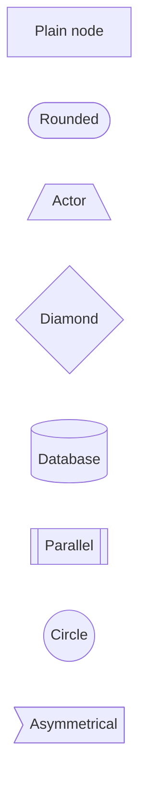
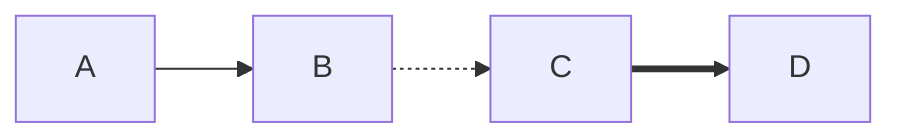
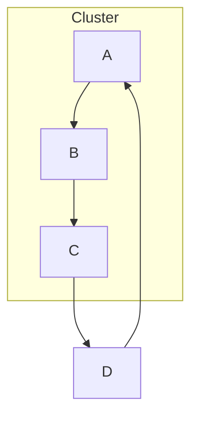
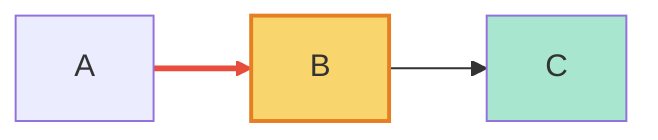
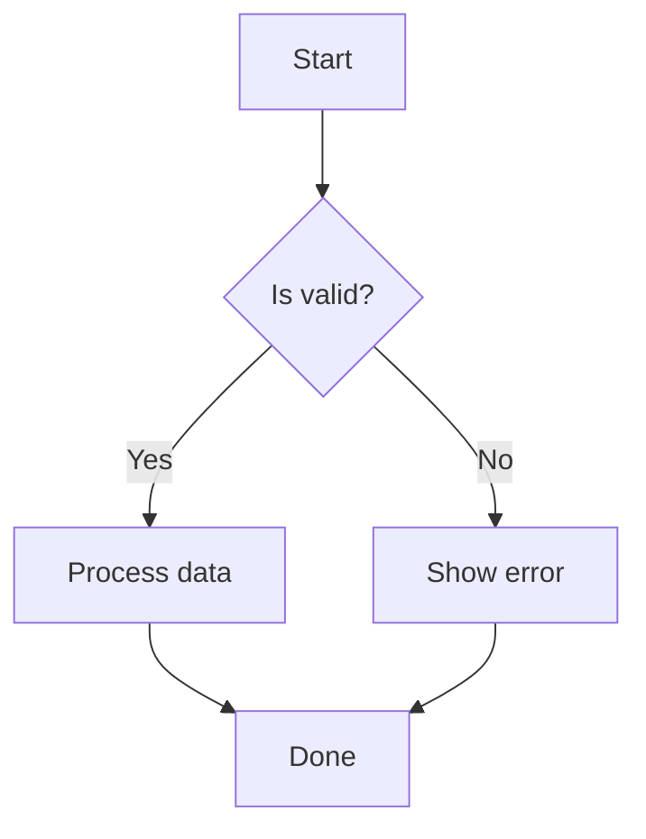
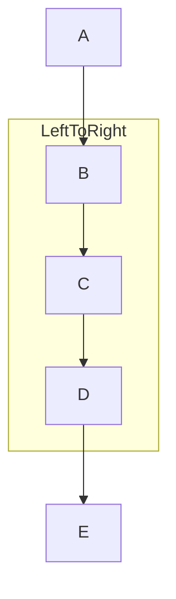

# Flowcharts

Flowcharts (and the legacy `graph` keyword) are Mermaid's most versatile diagram type. They model processes, workflows, decision trees, and system architectures.

## Declaration

```mermaid
flowchart LR
```

Direction keywords: `TB` (top-to-bottom, default), `LR` (left-to-right), `RL`, `BT`. Use `graph TD` as a legacy alternative.

## Nodes

Plain identifiers or quoted labels. Shapes wrap the label in special brackets.



## Edges

`-->`, `-.->` (dotted), `-.-.` (dashed), `===` (thick). Add text with `-->|label|`. Arrowheads: `--o`, `--x`, `o--`, `x--`, `o--o`, `x--x`.



## Subgraphs

Group related nodes. Use `direction` to override flow inside the subgraph.



## Styling

Apply via `class`, `style`, or `linkStyle`. Classes are defined with `classDef`.



## Conditional (if/else)



## Direction Override Per Subgraph


