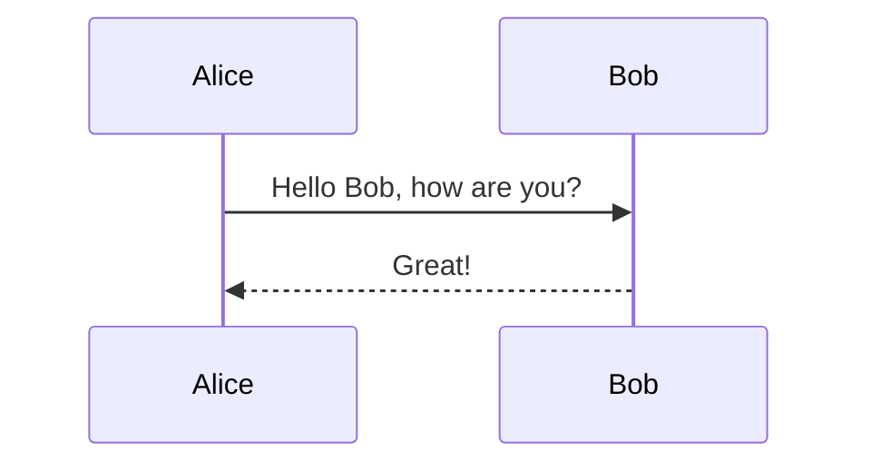
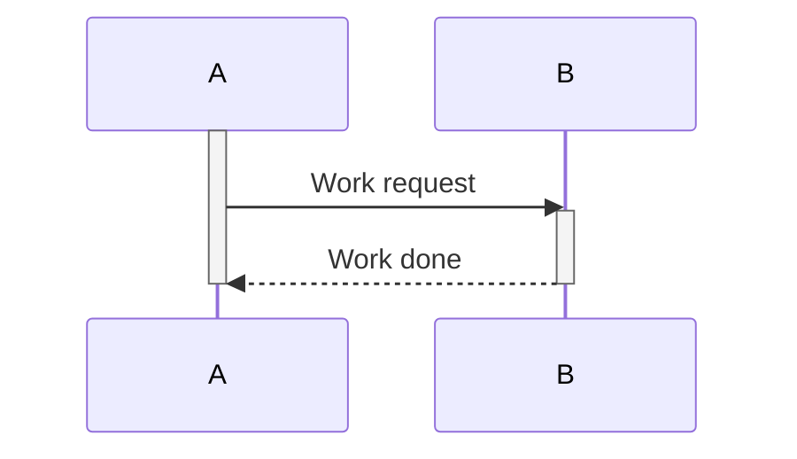
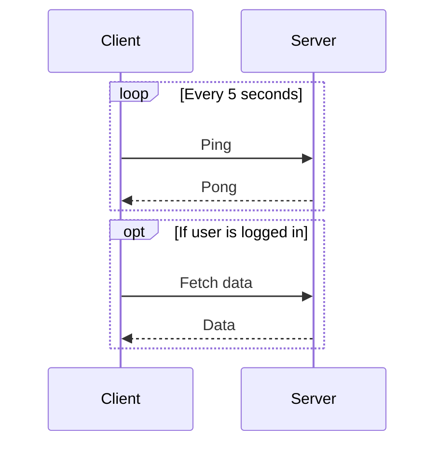
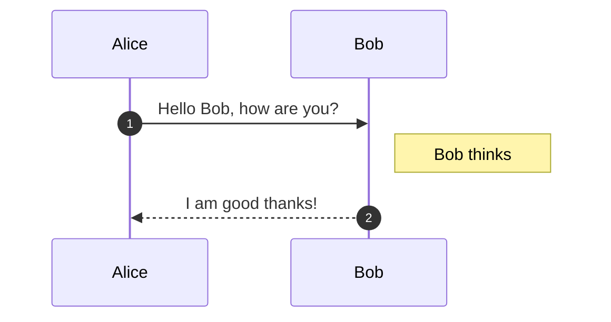
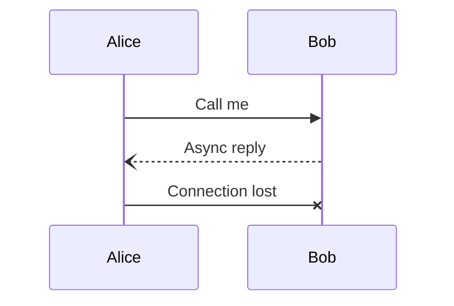

# Sequence Diagrams

Sequence diagrams model interactions between participants over time, showing message ordering and activation lifelines.

## Declaration

```mermaid
sequenceDiagram
```

## Participants and Messages

Use `->>` for synchronous (solid arrow) and `-` for return messages. Add participant labels with `participant`.



## Activations

Use `activate`/`deactivate` or the shorthand `autonumber`. The `over` keyword spans activations across participants.



## Loops and Conditions

Group messages with `loop`, `alt`/`else`, `opt`, `par` (parallel), and `break`.



## Autonumber and Notes

`autonumber` prefixes messages with sequential numbers. `note` adds annotations.



## Dotted and Async Messages

Use `-x` for destroyed messages, `--)` for async (open arrowhead).


