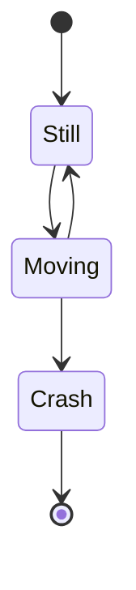
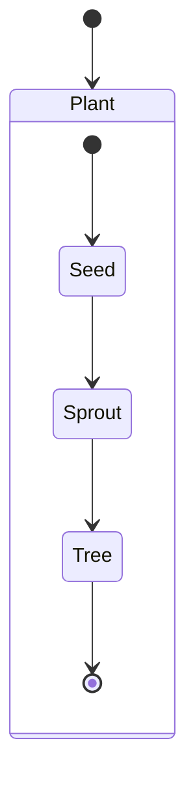
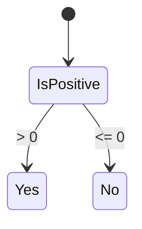
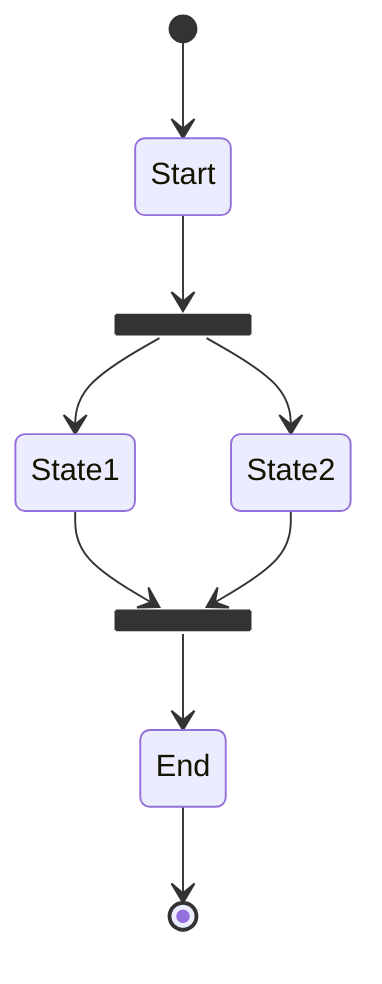
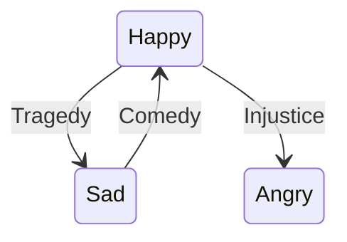
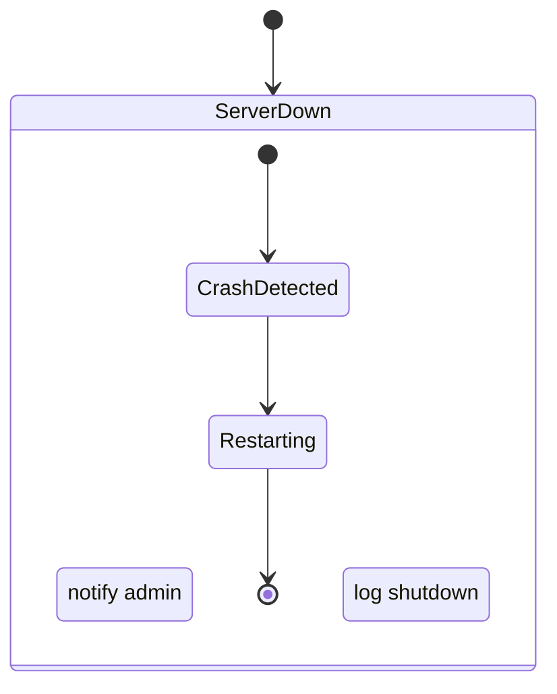

# State Diagrams

State diagrams model the lifecycle of an entity through states and transitions. Use `stateDiagram-v2` for composite states, concurrency, and postconditions.

## Declaration

```mermaid
stateDiagram-v2
```

## Basic States and Transitions

States are plain identifiers or labeled with `[label]`. Transitions use `-->`. Initial and final states use `[*]`.



## Composite (Nested) States

Group sub-states inside a named state block.



## Choice (Decision) Points

Use `choice` to model branching based on conditions.



## Fork and Join (Concurrency)

Split into parallel regions with `fork`/`join`.



## Labeled Transitions with Conditions

Add guard conditions using `: condition` or `-->|label|`.



## Postconditions (Entry/Exit)

Use `entry` and `exit` actions inside state blocks.


