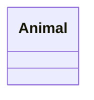
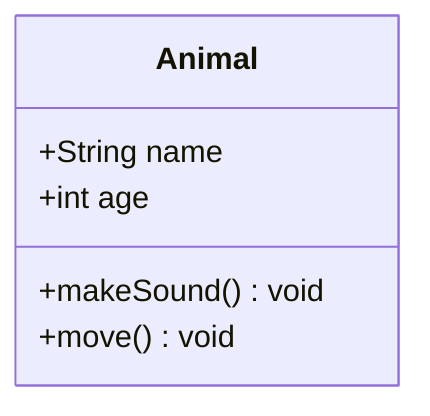
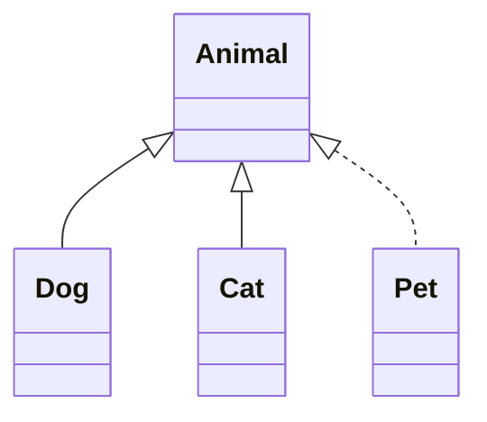
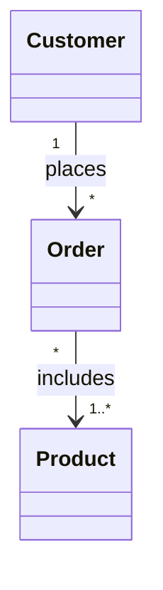
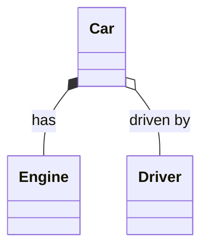
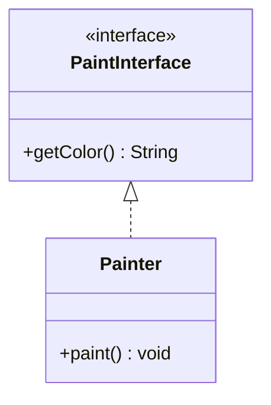
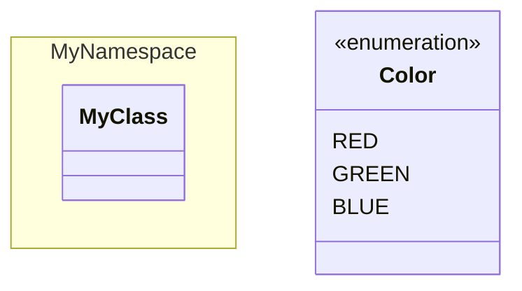
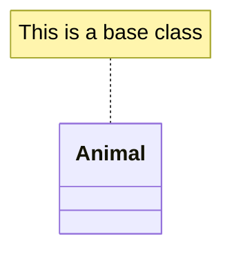

# Class Diagrams

Class diagrams model the static structure of a system using UML-style classes, interfaces, enums, and their relationships.

## Declaration

## Basic Classes with Attributes and Methods

Use `+` (public), `-` (private), `#` (protected), `~` (package). Prefix methods/attributes with type annotations.

## Inheritance and Realization

`--|>` is inheritance (extends). `..|>` is realization (implements).

## Associations and Composition

`--` is association, `*--` is composition, `o--` is aggregation. Add multiplicity with `1`, `*`, `0..1`.

## Composition and Aggregation

Composition (filled diamond) vs aggregation (open diamond).

## Interfaces

Use `<<interface>>` stereotype.

## Enums and Namespaces

Enums use `<<enumeration>>`. Wrap classes in namespaces with `namespace`.

## Notes and Annotations

Attach notes to classes.

