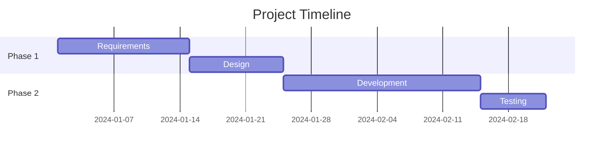
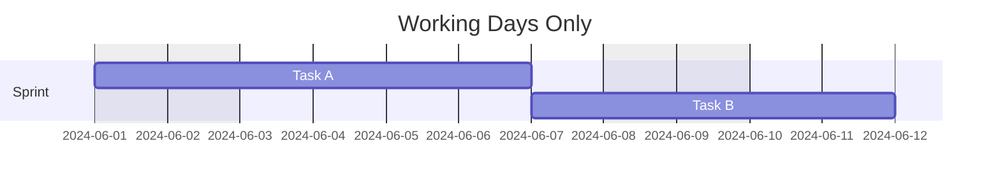
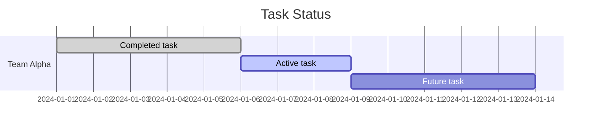
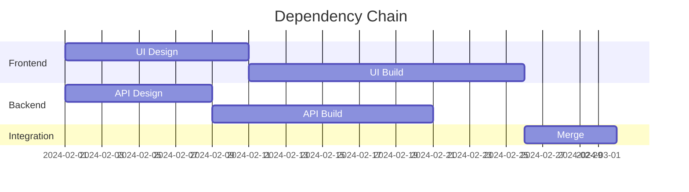
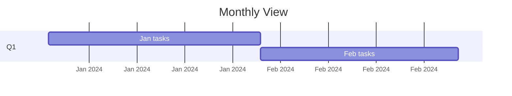

# Gantt Charts

Gantt charts visualize project schedules with tasks, durations, dependencies, and milestones.

## Declaration

```mermaid
gantt
```

## Basic Tasks and Dates

Define title, axis format, and tasks with start dates. Use `section` to group.



## Milestones

Milestones are zero-duration tasks marked with `milestone`.

```mermaid
gantt
    title Release Plan
    dateFormat  YYYY-MM-DD
    section Planning
    Kickoff         :ms1, milestone, 2024-03-01, 0d
    Requirements    :a1, 2024-03-01, 14d
    section Execution
    Development     :a2, after a1, 30d
    Launch          :ms2, milestone, after a2, 0d
```

## Excluding Weekends and Holidays

Use `excludes` to skip weekends or specific dates.



## Active and Completed Tasks

Mark tasks as done with `done` or partially complete with `crit`.



## Dependencies and Parallel Tasks

Chain tasks with `after` and run parallel tracks.



## Custom Axis Formats

Control date display with `axisFormat`.


