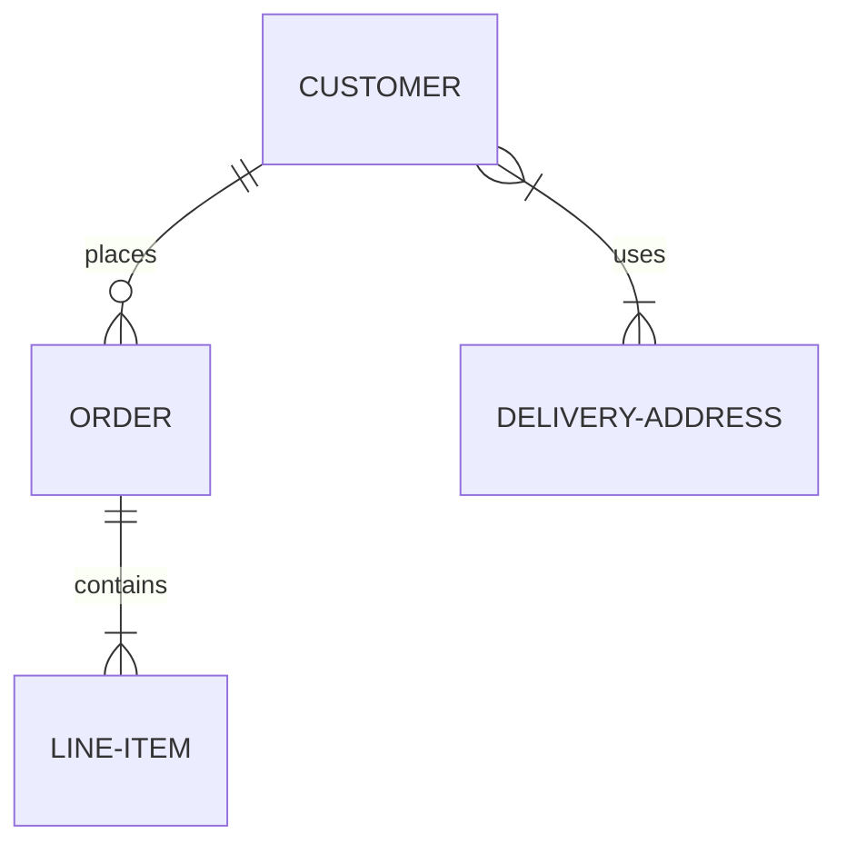
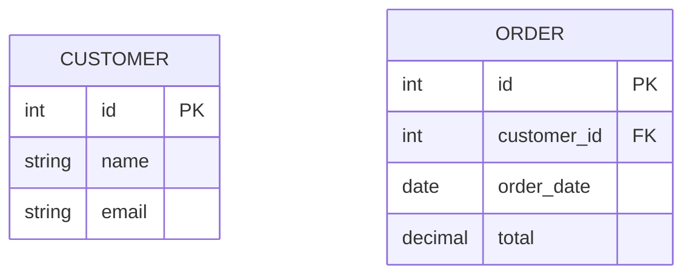
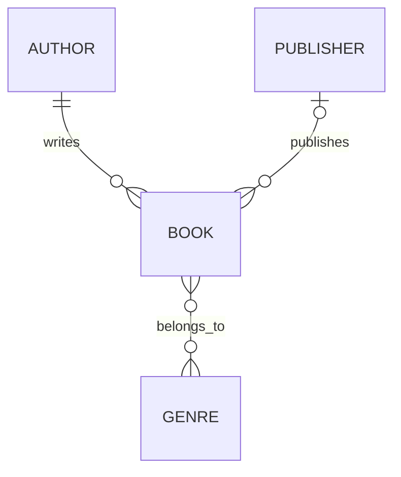
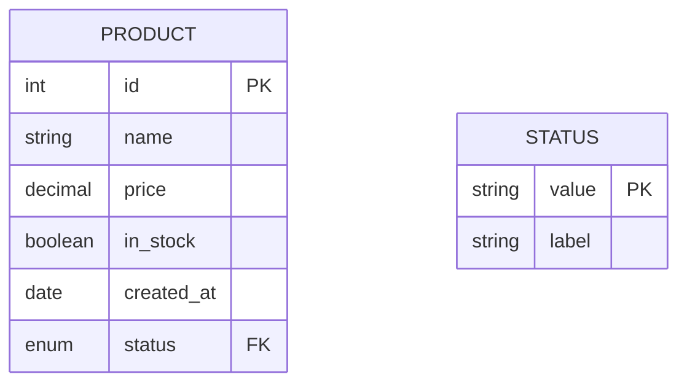
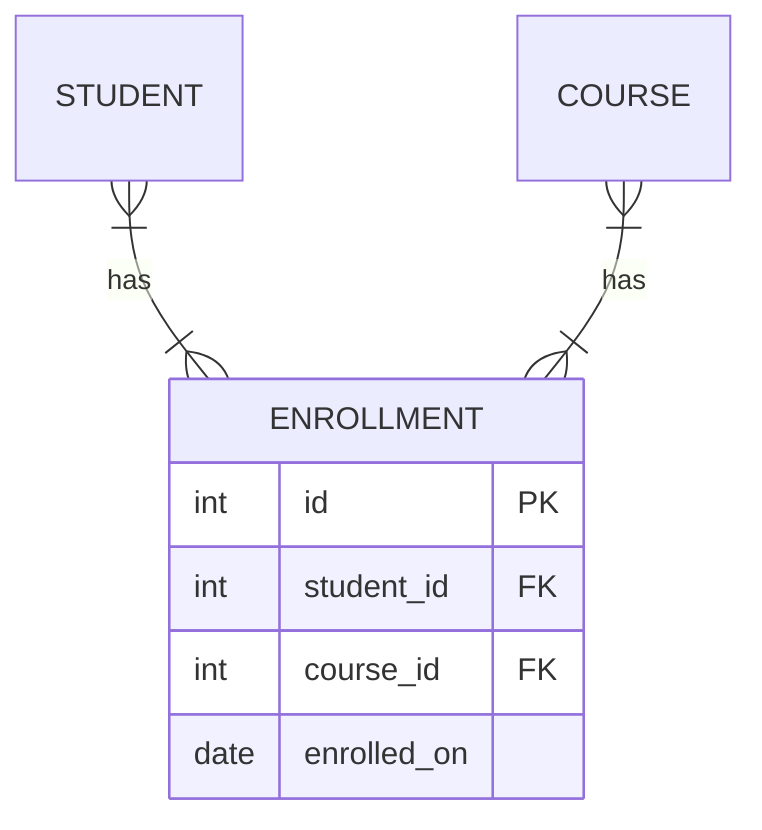

# Entity-Relationship Diagrams

ER diagrams model database schemas with entities, attributes, keys, and relationship cardinality.

## Declaration

```mermaid
erDiagram
```

## Basic Entities and Relationships

Define entities with `{}`. Relationships use `||--o{` (one-to-many), `|--|{` (many-to-one), etc.



## Attributes and Keys

List attributes inside entity blocks. Mark primary keys with `PK` and foreign keys with `FK`.



## Cardinality Notation

`||` = exactly one, `|o` = zero or one, `}{` = one or more, `o{` = zero or more.



## Data Types

Mermaid supports common SQL types: `int`, `string`, `boolean`, `date`, `datetime`, `decimal`, `enum`.



## Many-to-Many Relationships

Use junction entities for many-to-many.


