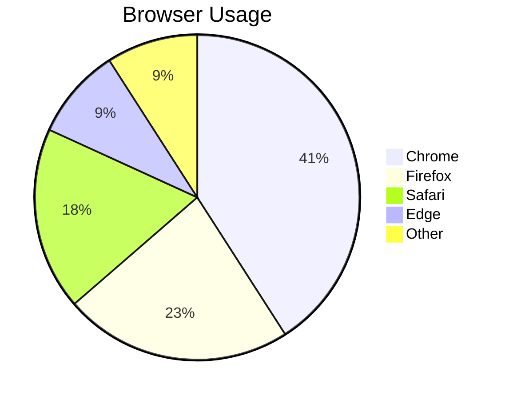
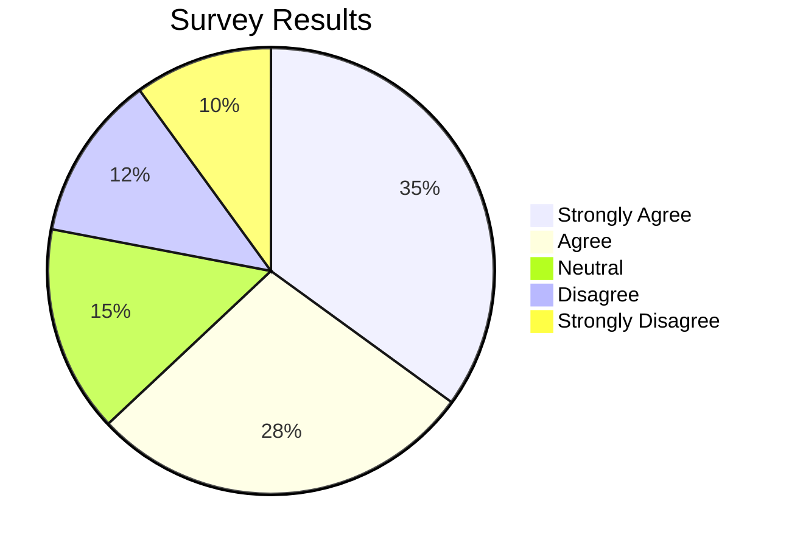

# Pie Charts

Pie charts display proportional data as slices of a circle.

## Declaration

```mermaid
pie
```

## Basic Pie Chart

Define title and slices with `: value`.



## With Percentages

Values are auto-normalized to percentages. Use integers or decimals.


