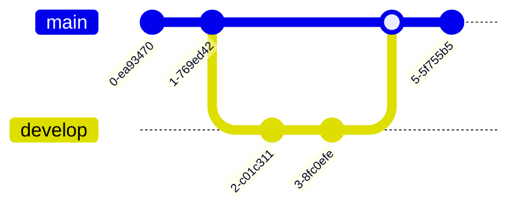
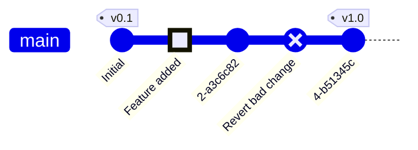
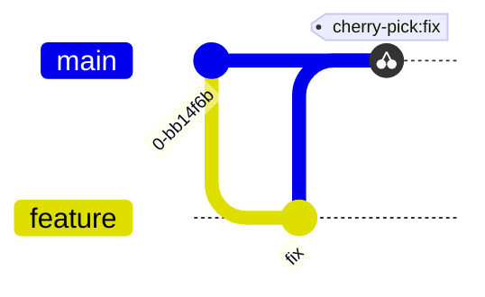
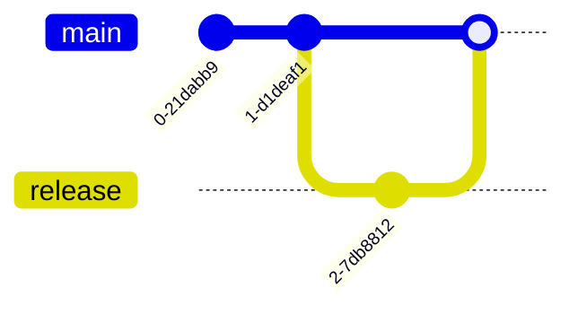
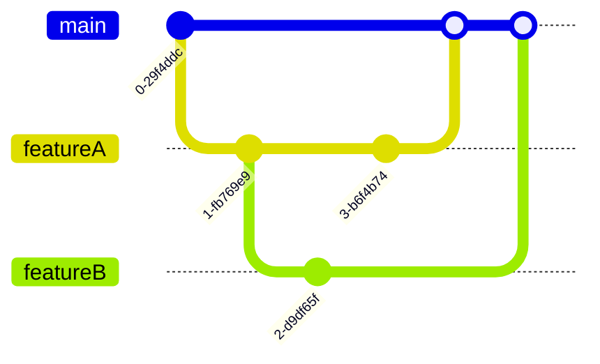

# Git Graphs

Git graphs visualize commit history, branches, merges, and cherry-picks.

## Declaration

## Basic Commits and Branches

Use `commit` for commits, `branch` for new branches, `checkout` to switch, `merge` to merge.

## Commit Types and Tags

Mark commits as `REVERT`, `HIGHLIGHT`, or add `tag`.

## Cherry-Pick

Use `cherry-pick` to apply a specific commit.

## Linear and Horizontal Layouts

Set `direction LR` for horizontal layout. Use `mainBranch` to rename.

## Complex Merge History

Multiple branches with diverging and merging.

