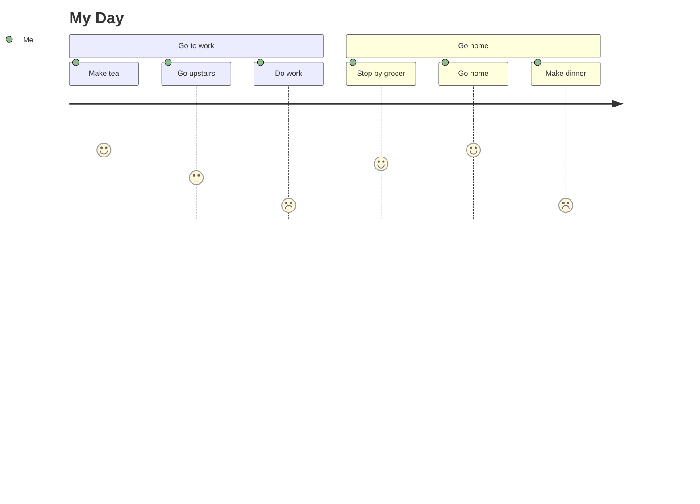
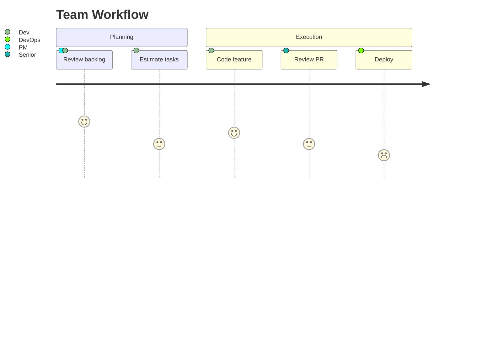
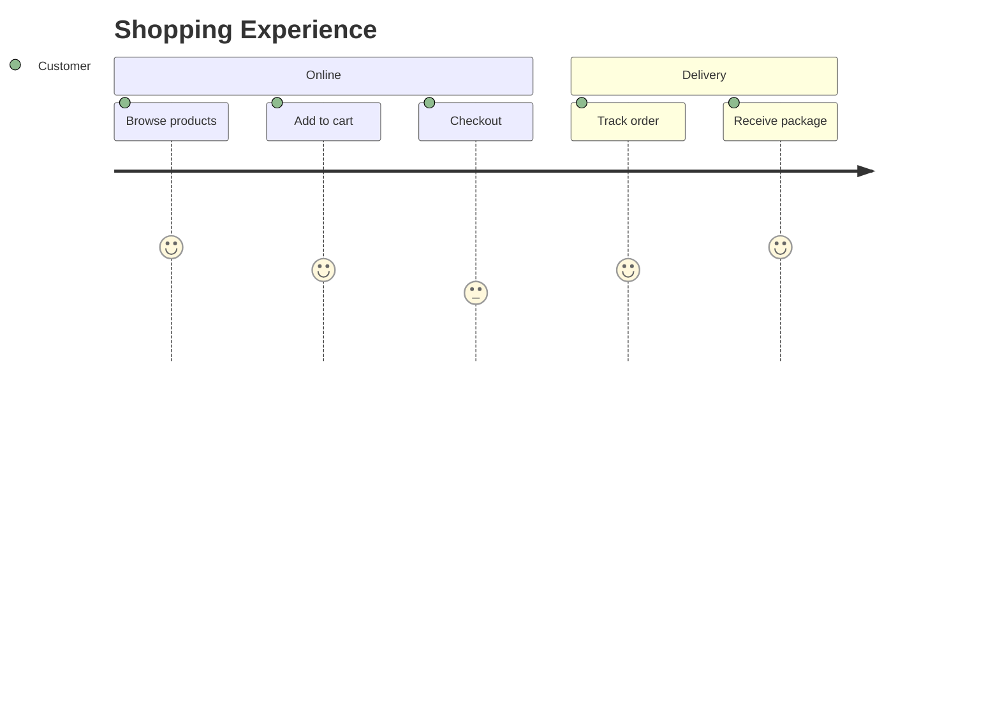

# User Journey Diagrams

User journey diagrams map the experience of a user through a process, with tasks scored by satisfaction.

## Declaration

```mermaid
journey
```

## Basic Journey

Define title, task count, and actor sections with scored tasks.



## Multiple Actors

Add multiple actors to a single journey.



## Section Grouping

Use sections to group related phases.


