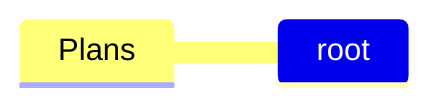
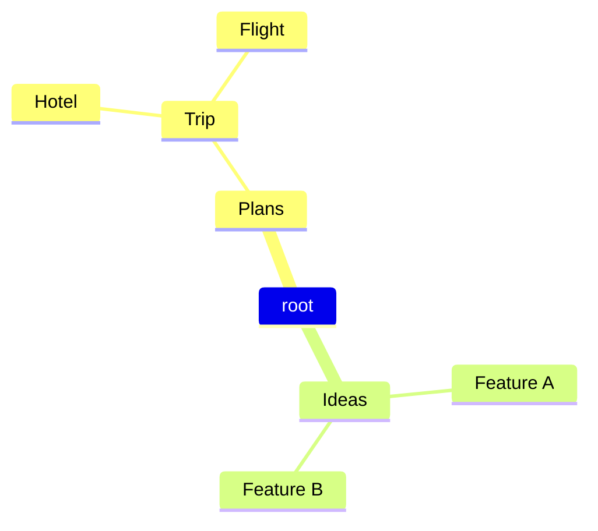
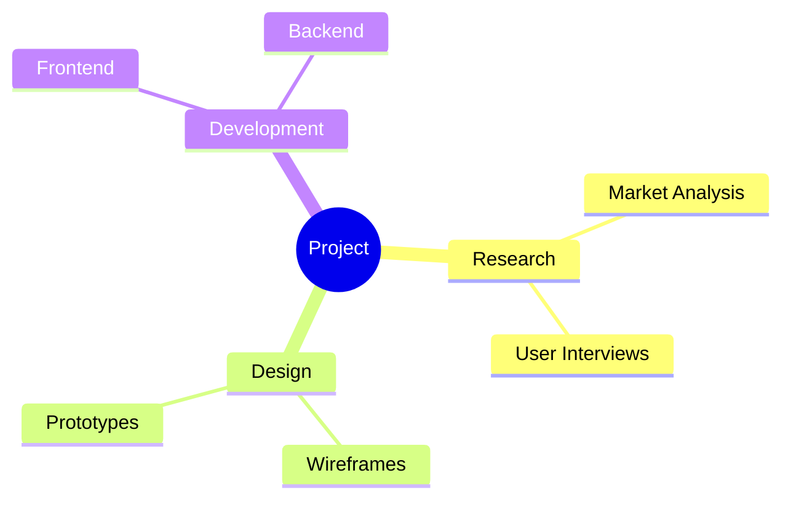
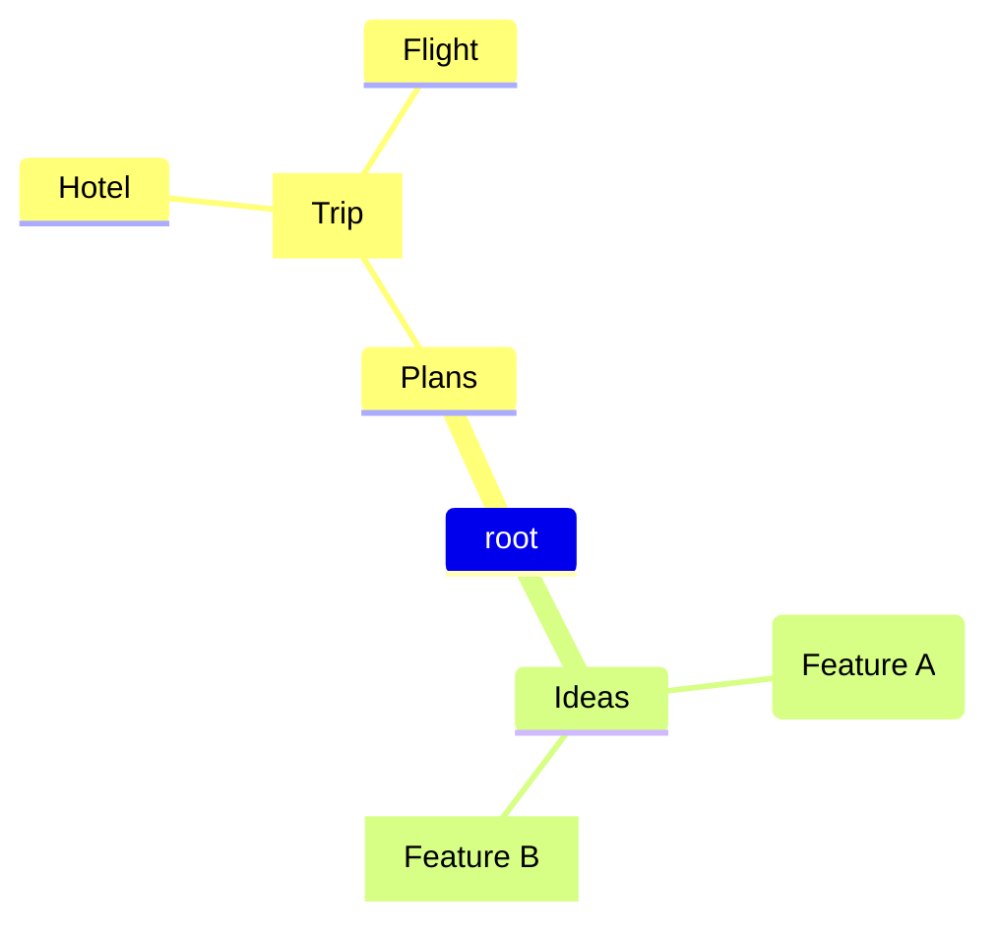
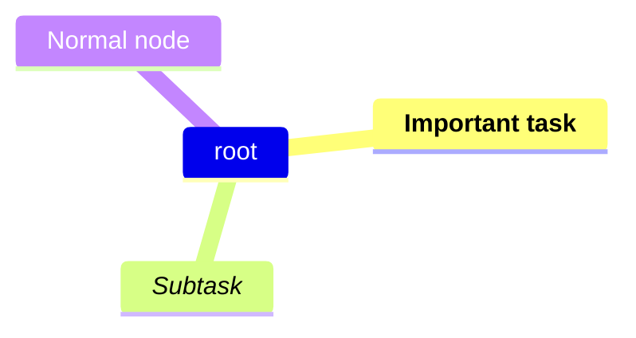

# Mindmaps

Mindmaps display hierarchical information radiating from a central topic.

## Declaration

## Basic Structure

Root node with indented children. Use `root` or any identifier for the center.

## Root Labeling

Label the root node explicitly.

## Shapes and Icons

Use shape brackets: `([square])`, `[(hexagon)]`, `([default])`, `([four point star])`. Add emoji icons.

## Markdown in Labels

Support bold, italic, and links inside labels.

