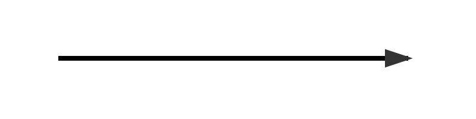
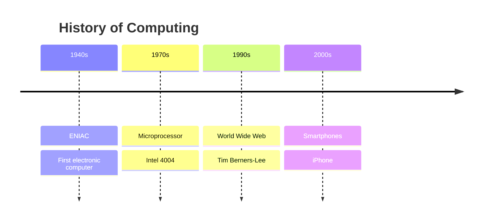
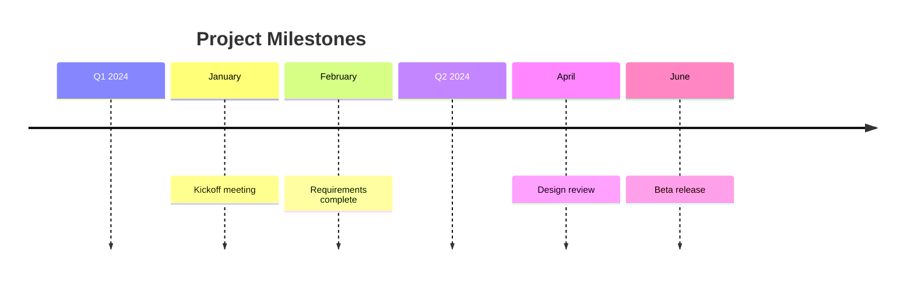
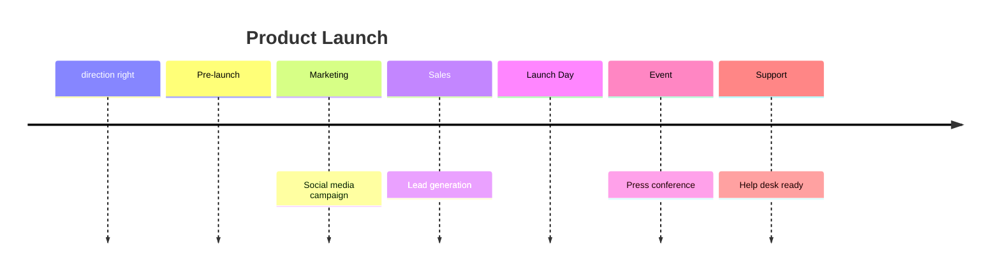
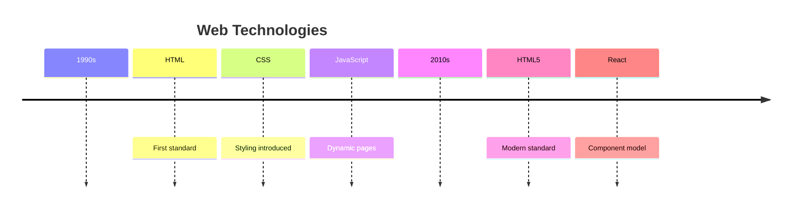

# Timeline Diagrams

Timelines display events chronologically with sections and directional layouts.

## Declaration

## Basic Timeline

Define title, sections (epochs), and events.

## Nested Sections

Group events within titled sections.

## Direction Control

Use `direction right` or `direction left` for horizontal timelines.

## Multiple Events per Section

List multiple events under a single section heading.

