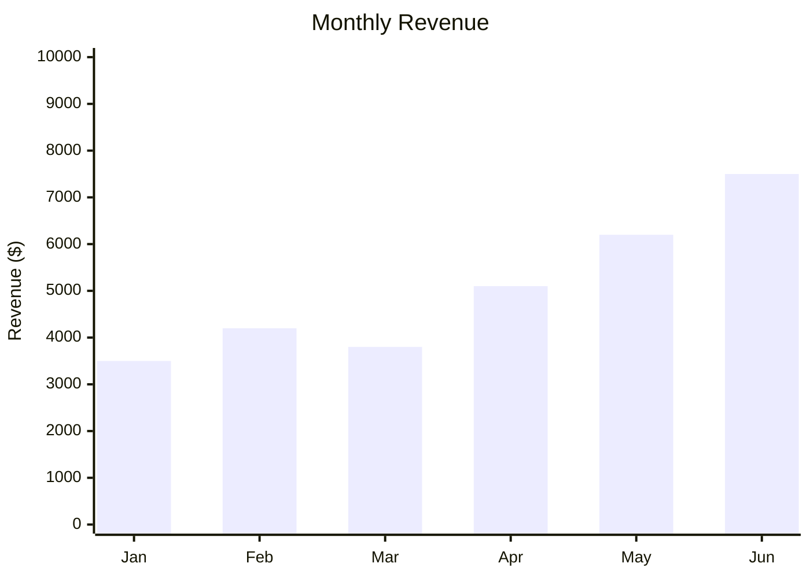
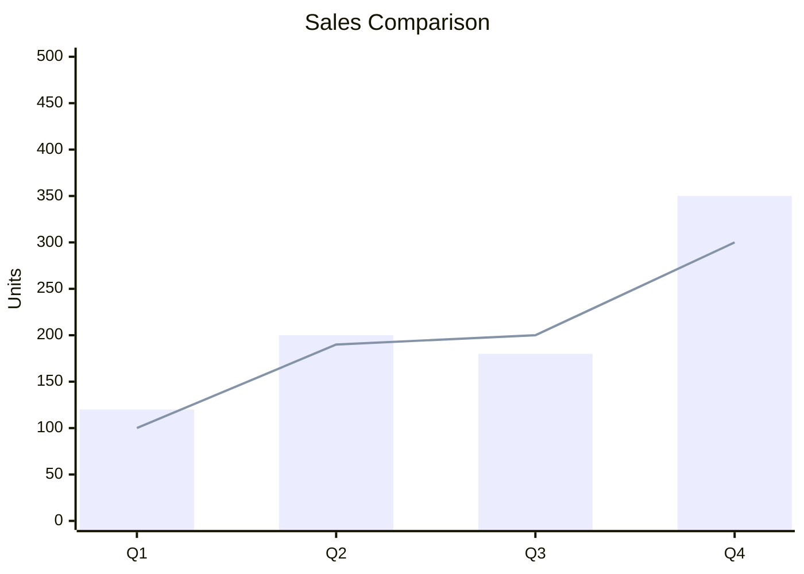

# XY Charts

XY charts render bar and line charts on two axes.

## Declaration

```mermaid
xychart-beta
```

## Bar Chart

Define title, axis labels, and bar data.



## Line Chart

Replace `bar` with `line`.

```mermaid
xychart-beta
    title "Temperature Trend"
    x-axis [Mon, Tue, Wed, Thu, Fri, Sat, Sun]
    y-axis "Temp (°C)" 0 --> 35
    line [22, 24, 21, 28, 30, 27, 25]
```

## Multiple Series

Add multiple `bar` or `line` entries.



## Stacked Bar Chart

Use multiple `bar` entries for stacked visualization.

```mermaid
xychart-beta
    title "Budget Breakdown"
    x-axis [Q1, Q2, Q3, Q4]
    y-axis "Amount ($K)" 0 --> 200
    bar [50, 60, 55, 80]
    bar [30, 40, 35, 50]
```


