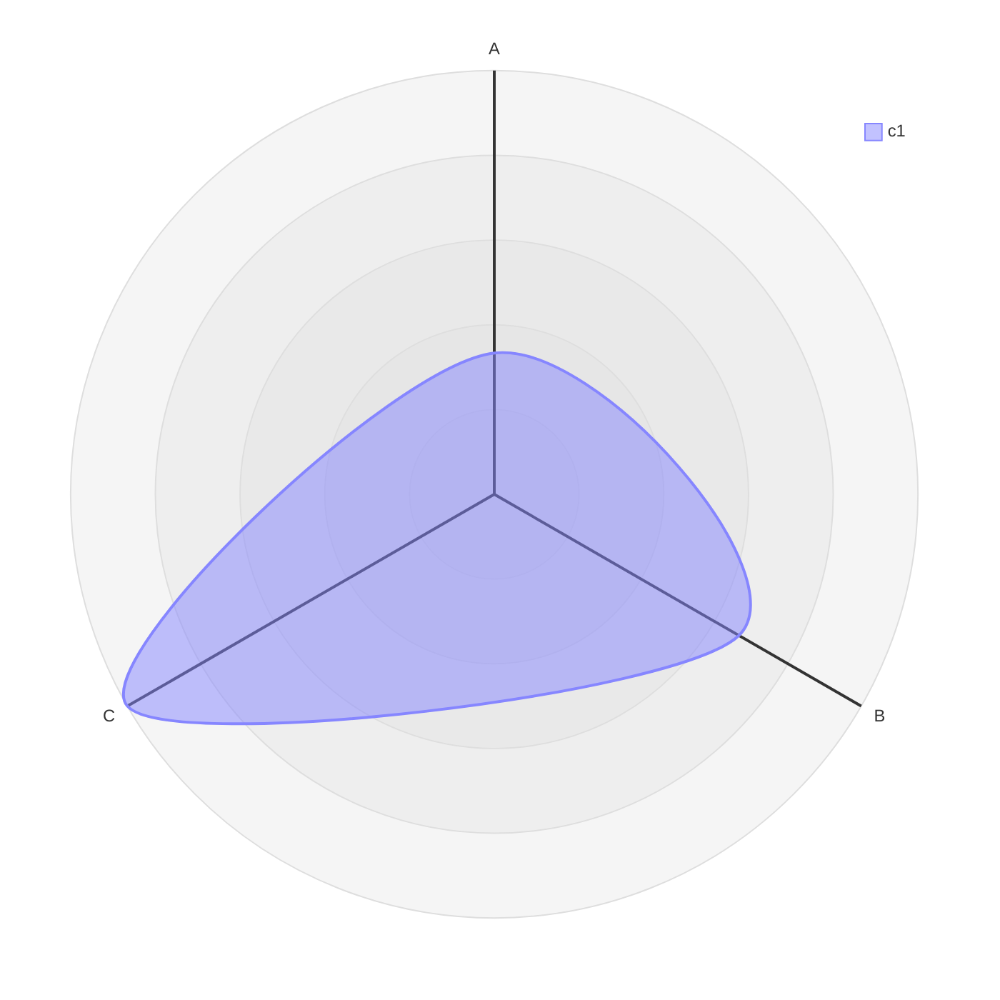
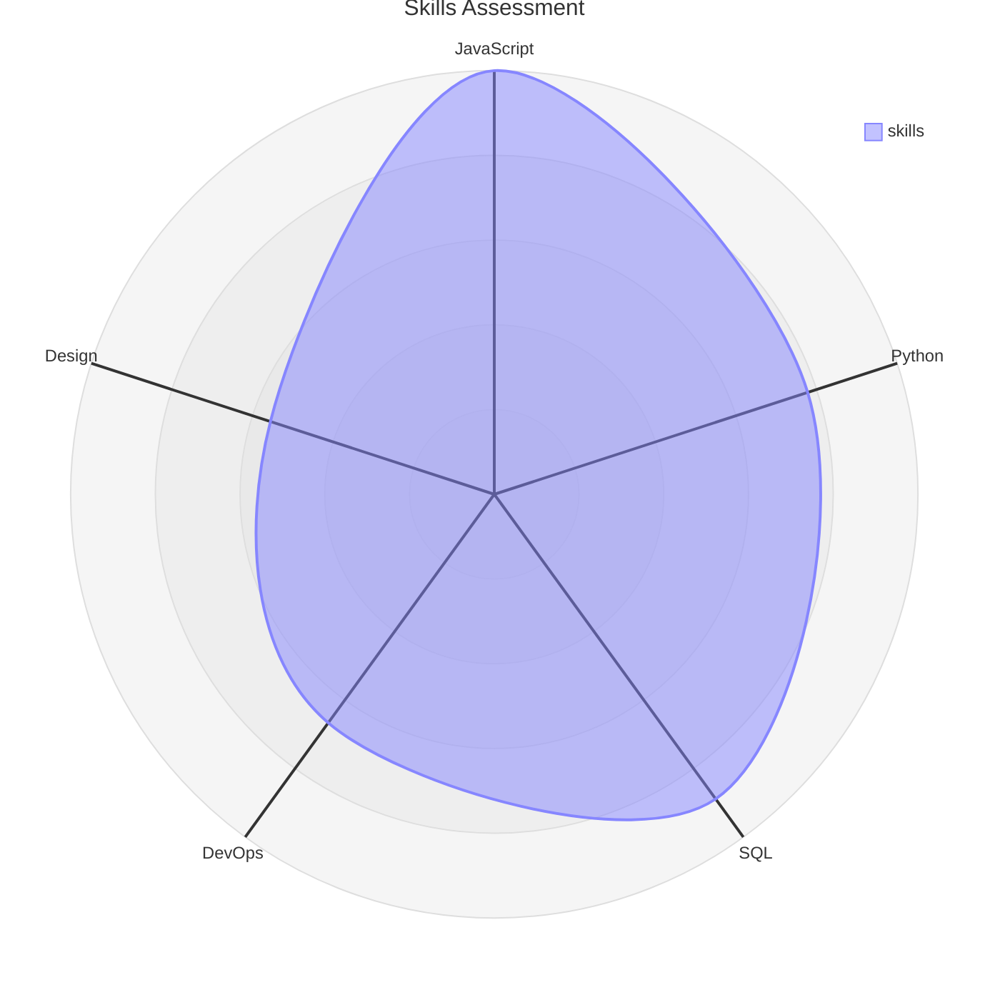
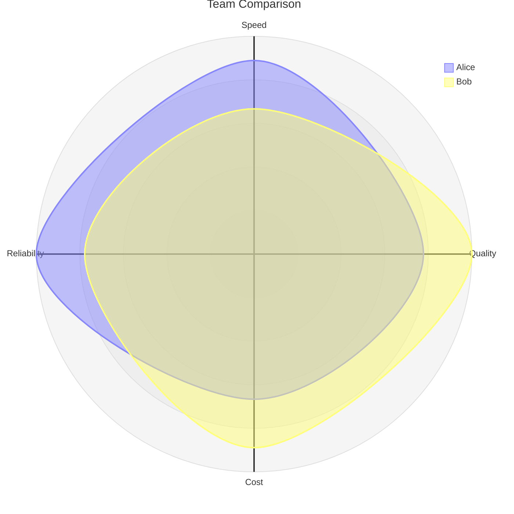
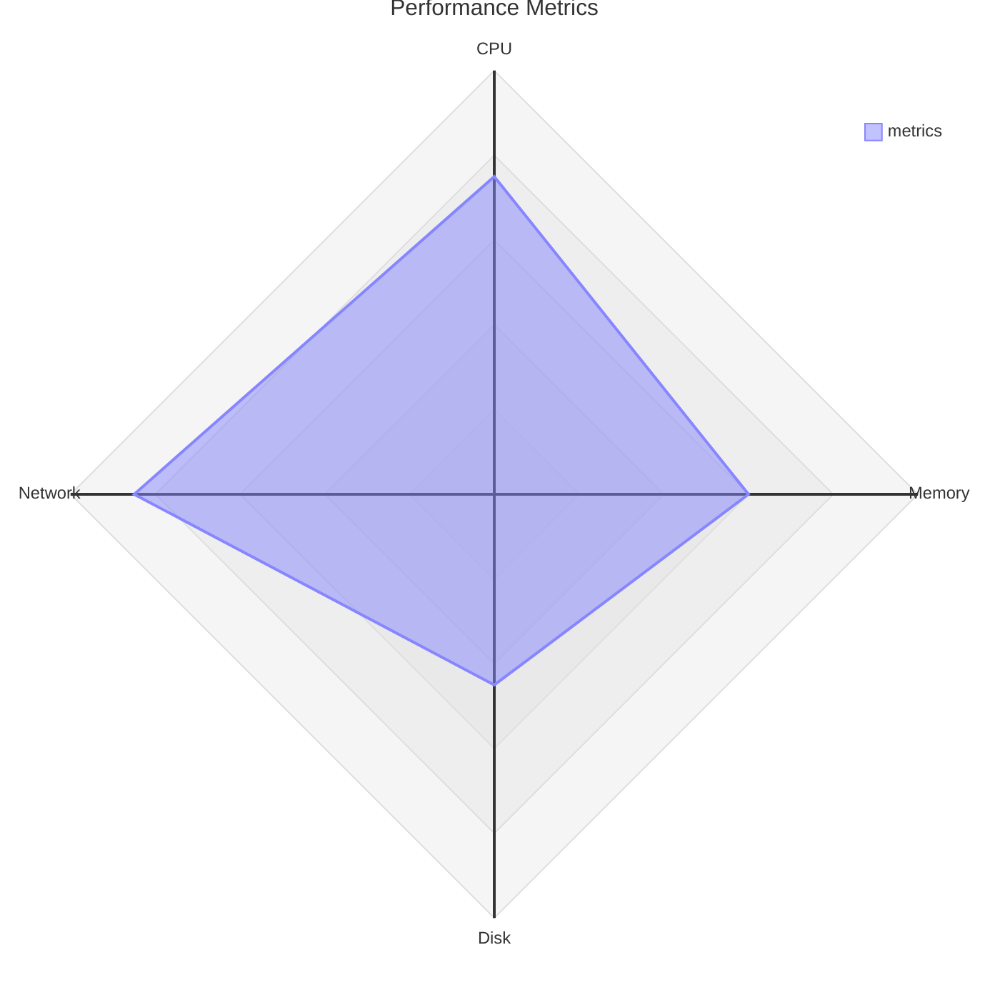

# Radar Charts

Radar (spider) charts plot multiple variables on axes radiating from a center point.

## Declaration

## Basic Radar Chart

Define axes with labels and curves with data values.

## Multiple Curves

Add multiple curves for comparison.

## Custom Scale and Graticule

Set `min`, `max`, `ticks`, and graticule style.

