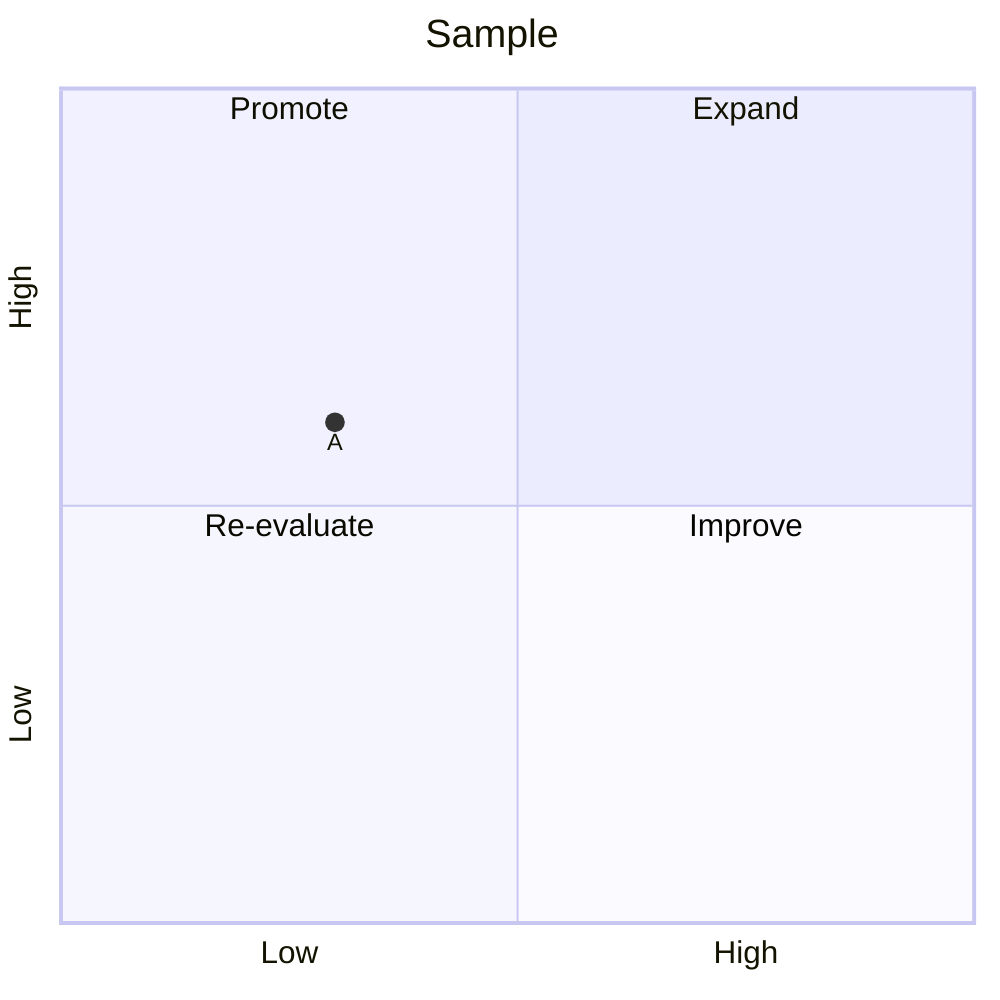
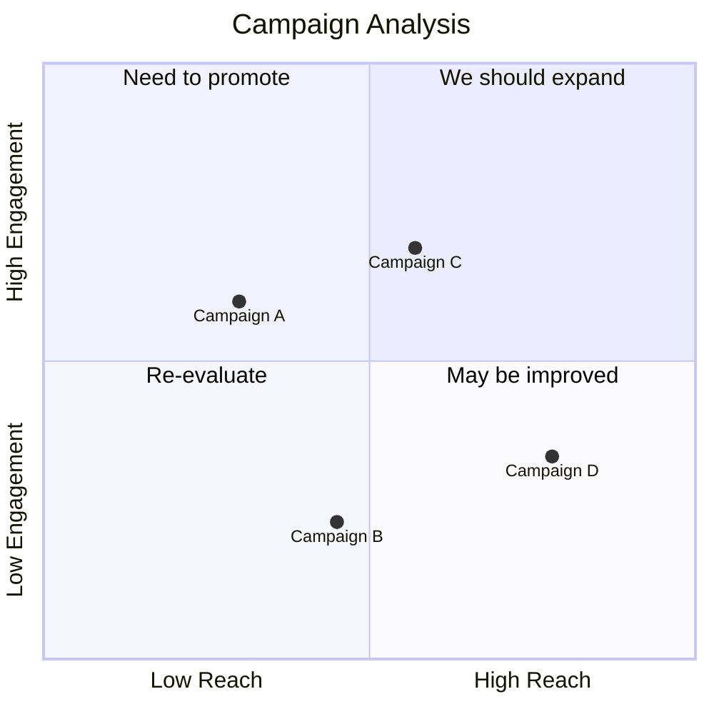
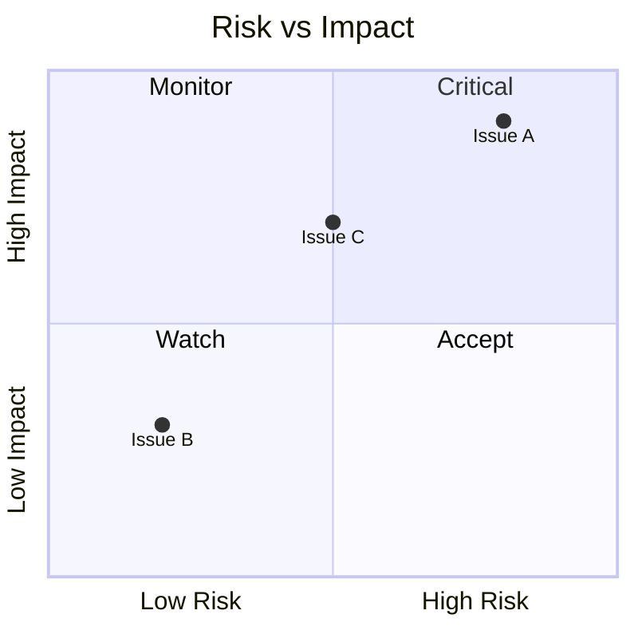

# Quadrant Charts

Quadrant charts plot data points on a 2D grid divided into four regions.

## Declaration

## Basic Quadrant Chart

Define axes, quadrants, and data points (x, y in range 0–1).

## With Config and Theme

Use YAML frontmatter for chart dimensions and theme variables.

