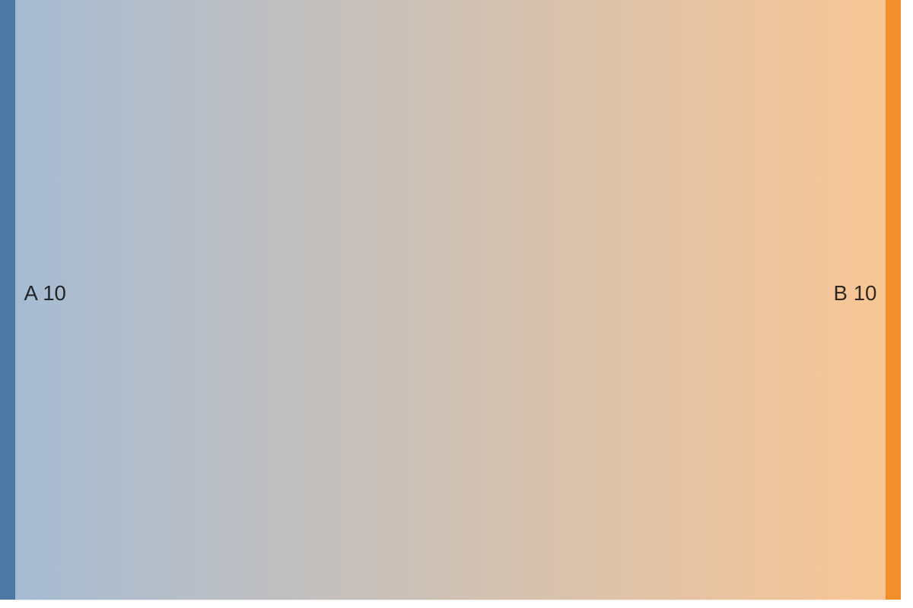
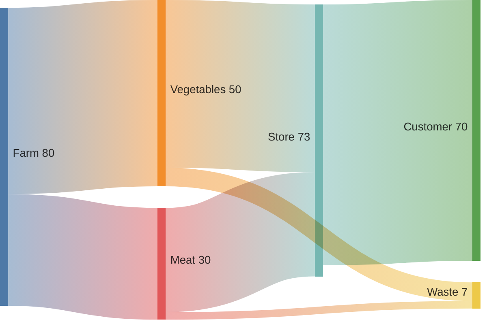
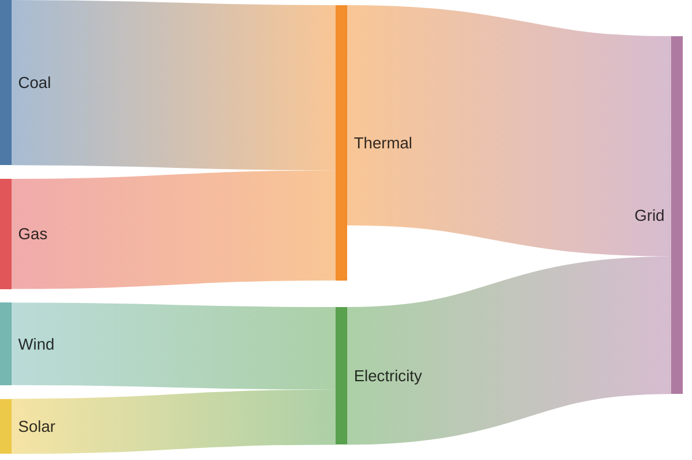
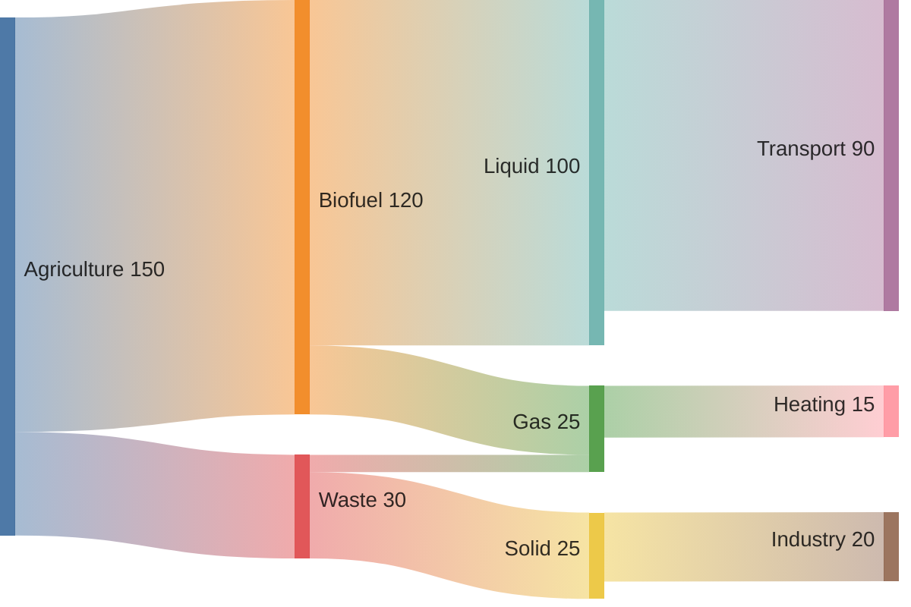

# Sankey Diagrams

Sankey diagrams visualize flows of values between nodes, with link thickness proportional to magnitude.

## Declaration

## Basic Sankey

List links as `Source,Target,value` per line.

## With Config

Use YAML frontmatter for per-diagram settings.

## Multi-Node Flows

Multiple sources and sinks with intermediate nodes.

