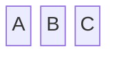
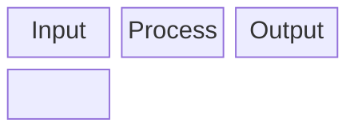
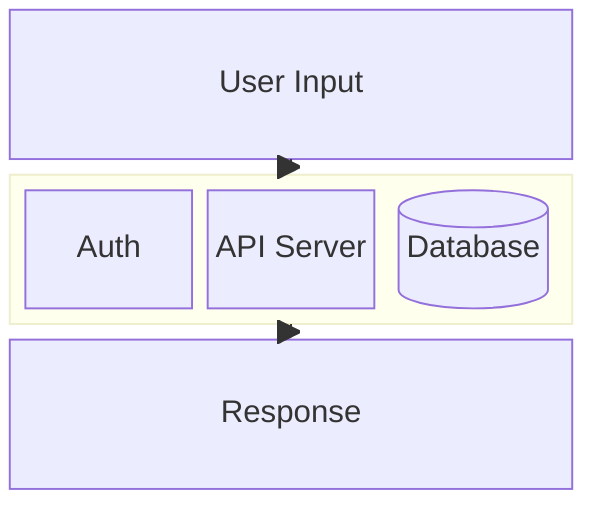
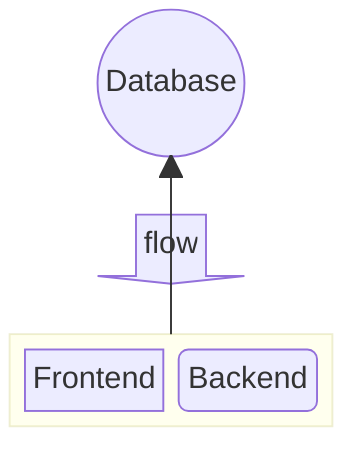
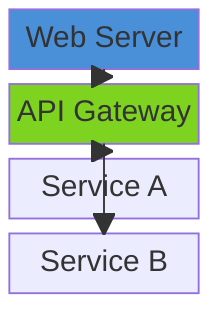
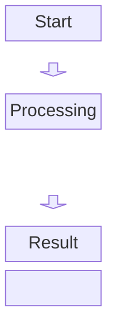

# Block Diagrams

Block diagrams give full layout control over component positioning using a grid-based approach.

## Declaration

## Basic Blocks

List blocks on one line for horizontal layout. Use `columns N` to define grid width.

## Nested Blocks (Containers)

Group blocks inside named containers with `block:end`.

## Block Shapes

Use flowchart-style shape syntax: `id[rect]`, `id(round)`, `id{diamond}`, `id((circle))`.

## Styling and Links

Apply styles and define connections between blocks.

## Arrows and Spacing

Use arrow blocks for visual flow indicators. Add `space` for gaps.

