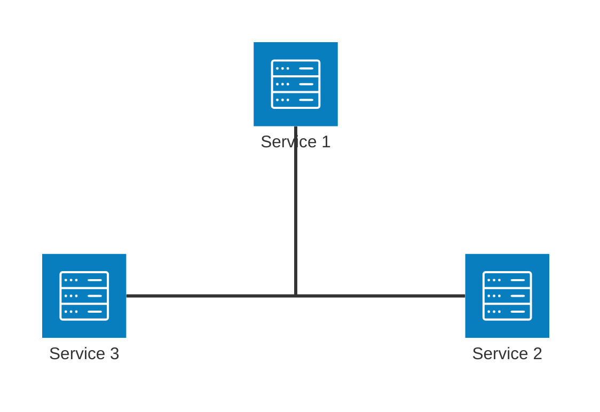

# Architecture Diagrams

Architecture diagrams visualize cloud and CI/CD deployments with groups, services, edges, and junctions.

## Declaration

## Basic Services and Groups

Define groups with icons and labels. Place services inside groups.

```mermaid
architecture-beta
    group api(cloud)[API Platform]
    service db(database)[Database] in api
    service cache(memory)[Cache] in api
    service web(server)[Web Server] in api
    db:L -- R:web
    cache:T -- B:web
```

## Nested Groups

Place groups inside parent groups.

```mermaid
architecture-beta
    group public(cloud)[Public VPC]
    group private(lock)[Private VPC] in public
    service lb(load_balancer)[Load Balancer] in public
    service app(server)[App Server] in private
    service db(database)[Database] in private
    lb:B -- T:app
    app:L -- R:db
```

## Edges with Direction

Use `:T`, `:B`, `:L`, `:R` for top/bottom/left/right connections.

```mermaid
architecture-beta
    service frontend(browser)[Frontend]
    service api(server)[API]
    service storage(disk)[Storage]
    frontend:B -- T:api
    api:L -- R:storage
```

## Junctions

Use junctions to reduce edge clutter at connection points.

## Multiple Icons

Choose from available icons: `server`, `database`, `cloud`, `lock`, `disk`, `browser`, `load_balancer`, `memory`, `user`.

```mermaid
architecture-beta
    group infra(cloud)[Infrastructure]
    service user1(user)[User A] in infra
    service user2(user)[User B] in infra
    service lb(load_balancer)[LB] in infra
    service app1(server)[App 1] in infra
    service app2(server)[App 2] in infra
    service db(database)[DB] in infra
    user1:B -- T:lb
    user2:B -- T:lb
    lb:L -- R:app1
    lb:R -- L:app2
    app1:B -- T:db
    app2:B -- T:db
```

