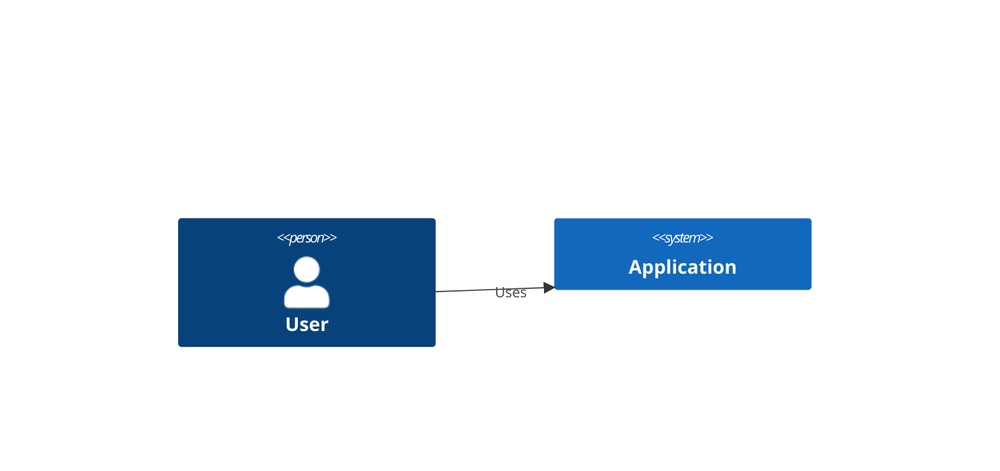
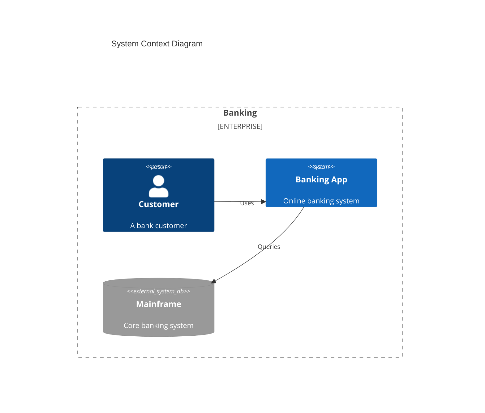
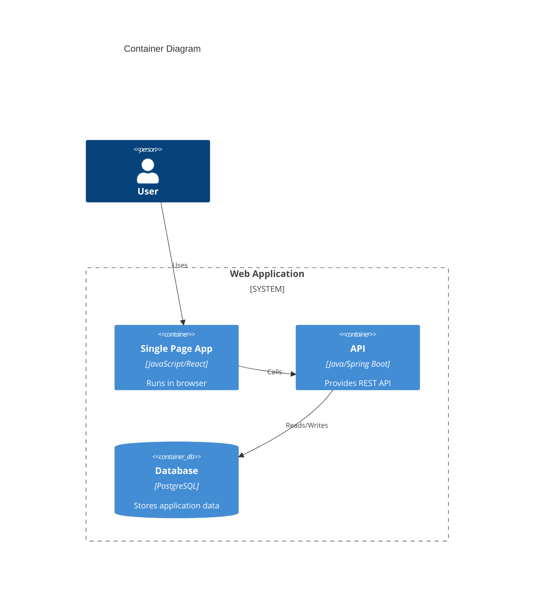
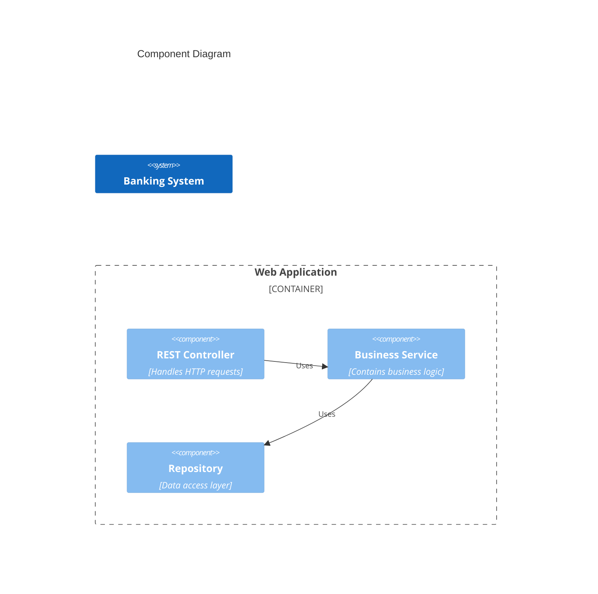
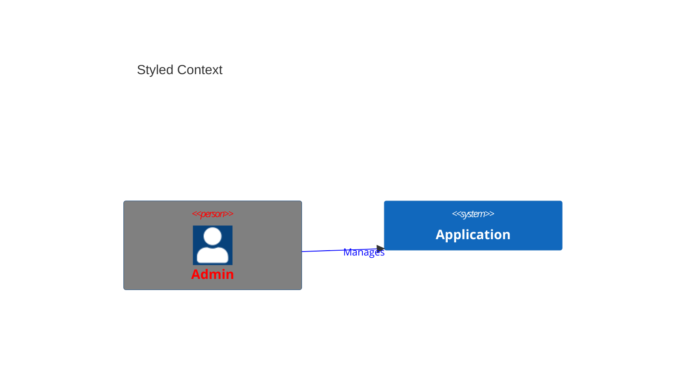

# C4 Diagrams

C4 diagrams model software architecture at multiple levels of abstraction: Context, Container, and Component.

## Declaration

Use `C4Context`, `C4Container`, `C4Component`, `C4Dynamic`, or `C4Deployment`.

## Context Diagram

Show the system and its users/stakeholders.

## Container Diagram

Show the high-level technology containers (web app, API, database).

## Component Diagram

Show components within a container.

## Styling and Layout

Use `UpdateElementStyle` and `UpdateRelStyle`. Set layout with `UpdateLayoutConfig`.

