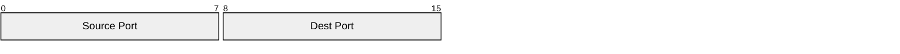
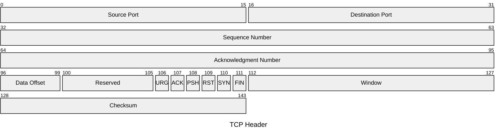
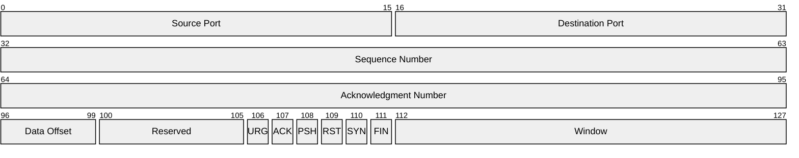
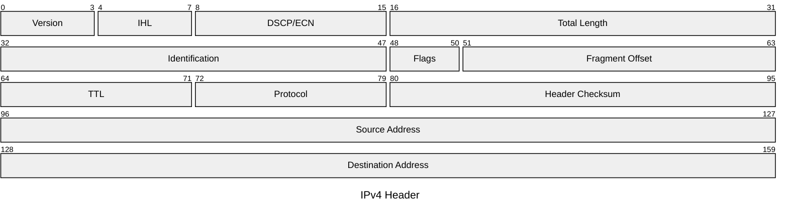

# Packet Diagrams

Packet diagrams visualize the bit-level structure of network protocol packets.

## Declaration

## Basic Packet Structure

Define fields with bit ranges and labels. Use `start-end` for multi-bit, `bit` for single-bit.

## Bit Count Syntax (v11.7.0+)

Use `+<count>` to auto-increment from the previous field end.

## Mixed Syntax

Mix range-based and count-based definitions.

