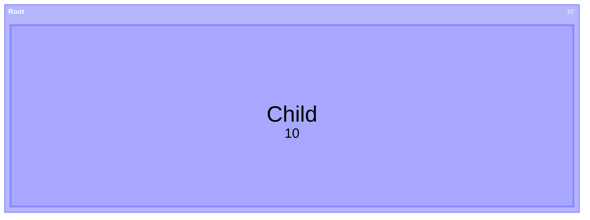
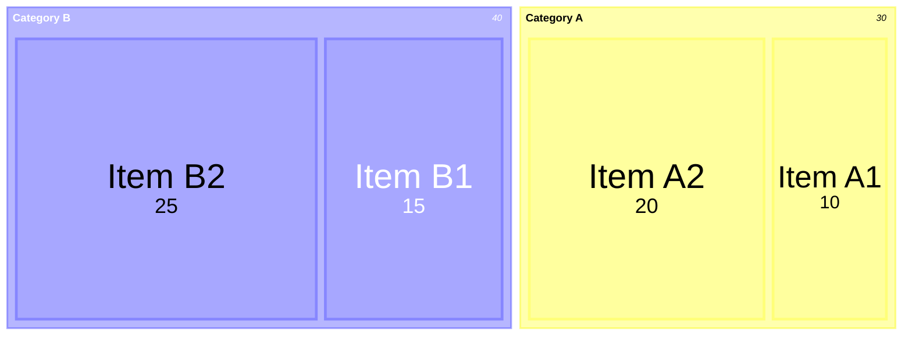
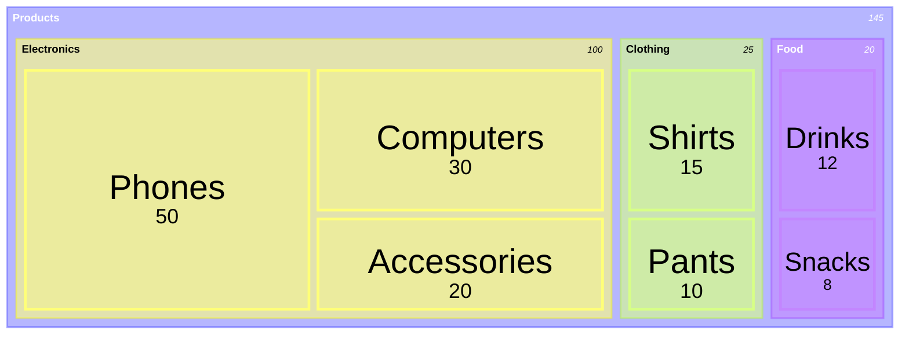
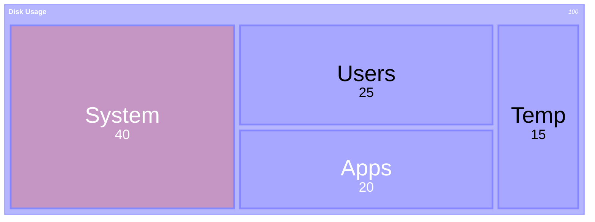

# Treemap Diagrams

Treemaps display hierarchical data as nested rectangles, sized proportionally to values.

## Declaration

## Basic Treemap

Define parent sections and leaf nodes with values.

## Hierarchical Treemap

Nest multiple levels deep.

## With Styling

Use `:::class` inline on nodes and `classDef` after the diagram.

