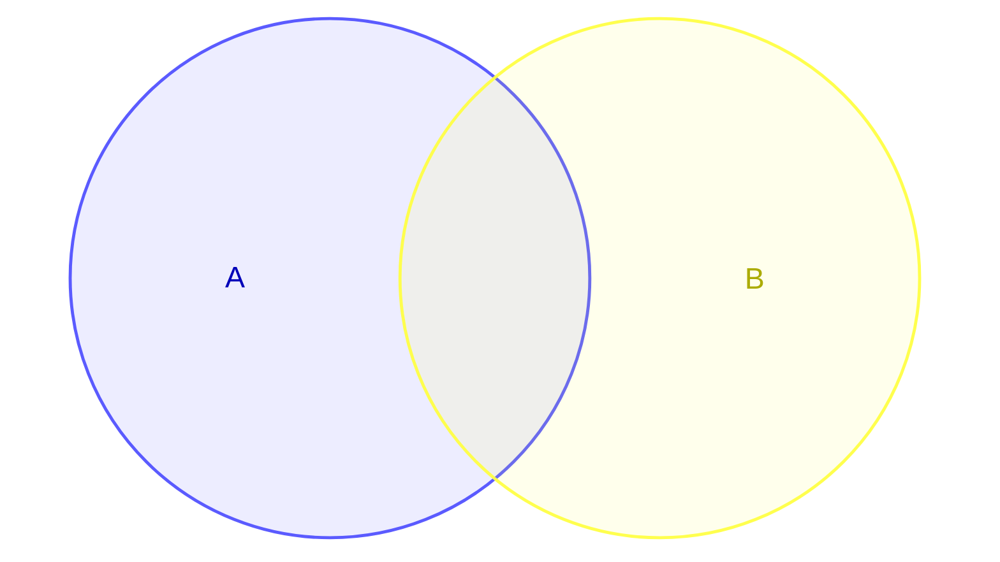
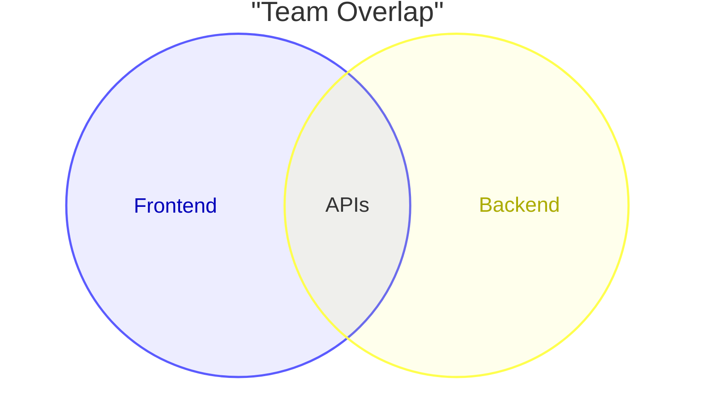
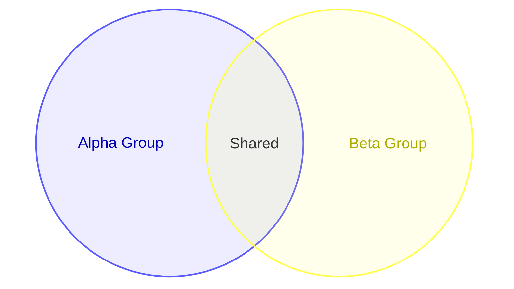
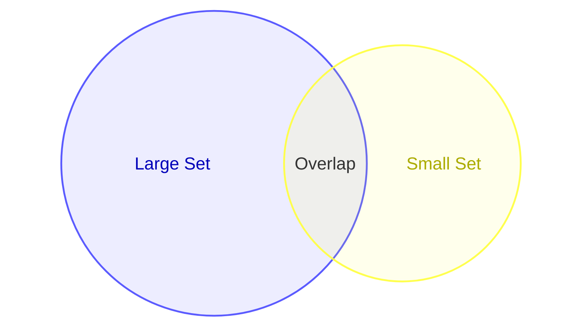
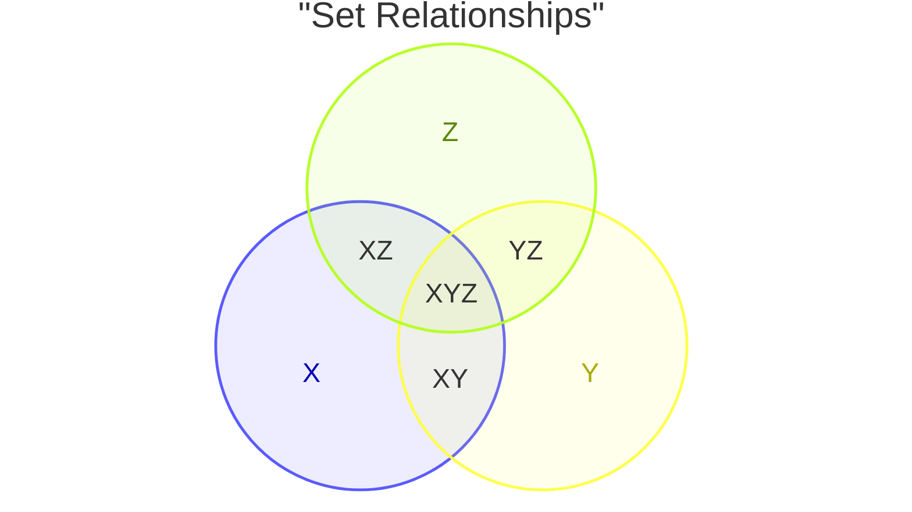

# Venn Diagrams

Venn diagrams show set relationships using overlapping circles.

## Declaration

## Basic Venn Diagram

Define sets and their intersections with `union`.

## Labeled Sets

Use bracket syntax for display labels.

## Sized Sets

Add `:N` suffix to control circle size.

## Three Sets

Define three overlapping sets.

