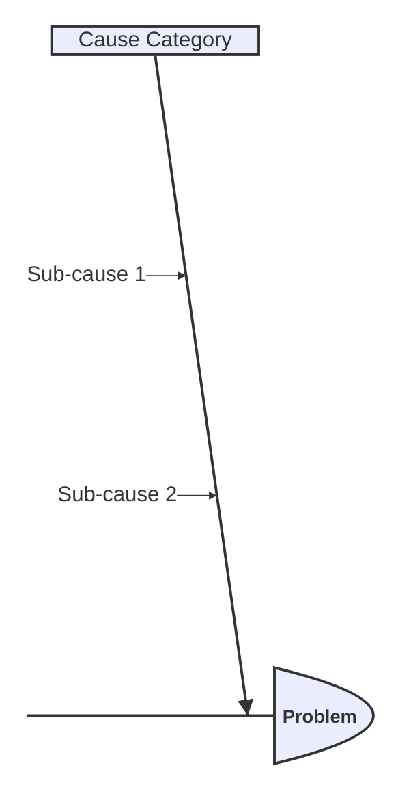
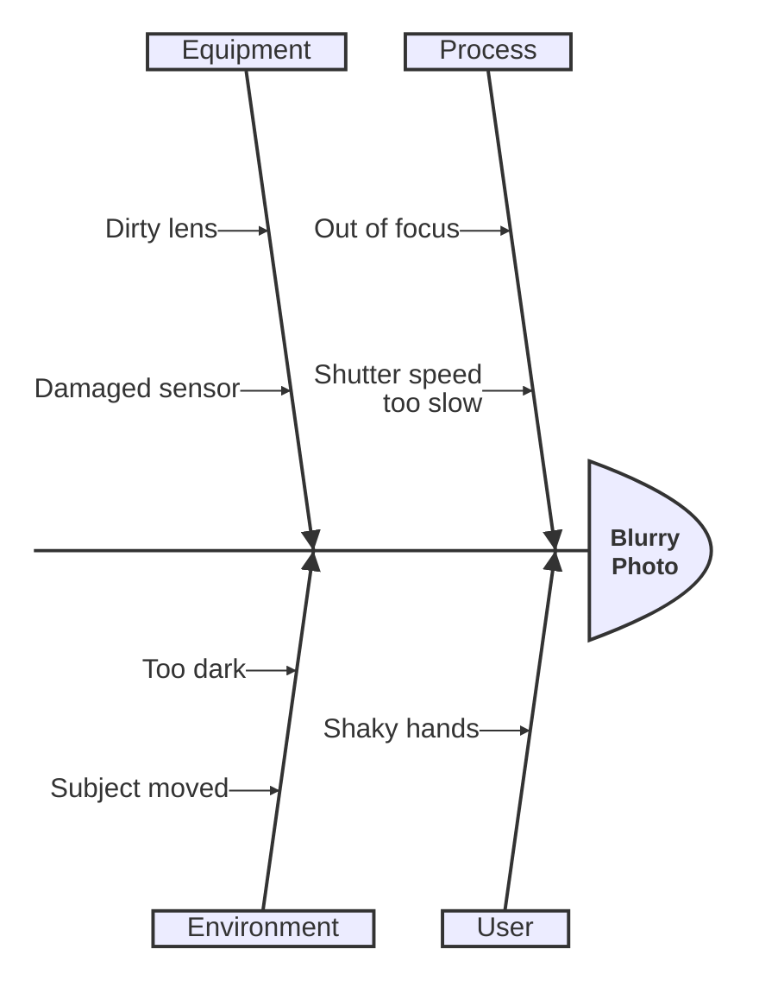
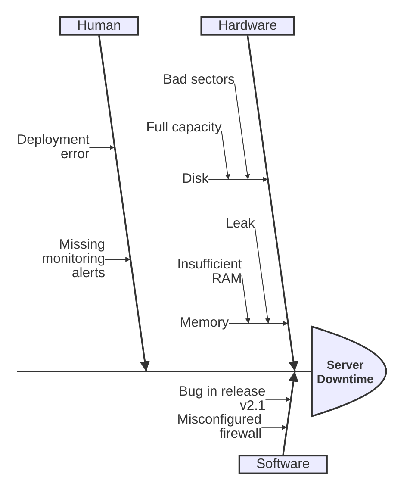
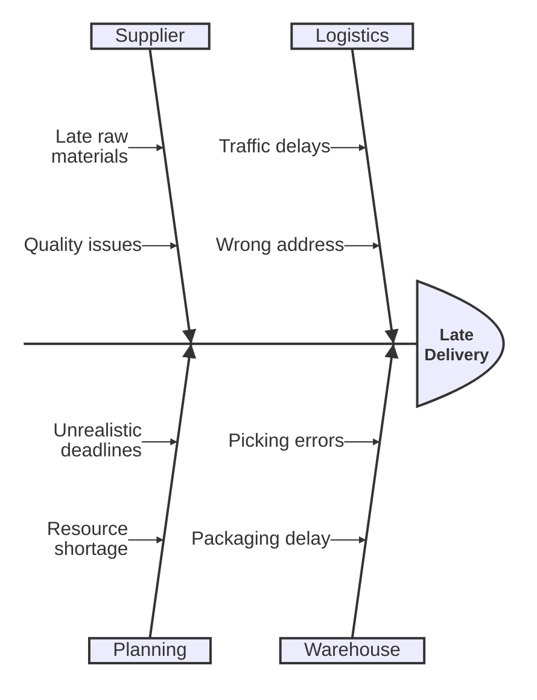

# Ishikawa (Fishbone) Diagrams

Ishikawa diagrams visualize cause-and-effect relationships, with the problem at the head and causes branching from the spine.

## Declaration

## Basic Fishbone

Define the problem (first line) and cause categories with indented sub-causes.

## Deeply Nested Causes

Nest causes multiple levels deep.

## With Many Categories

Use multiple cause categories for comprehensive analysis.

