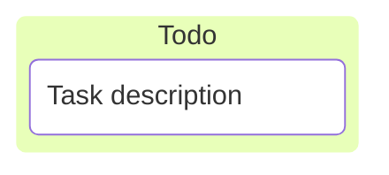
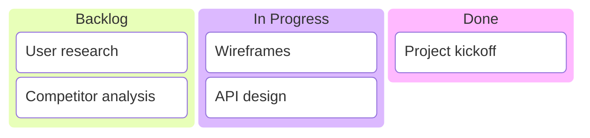
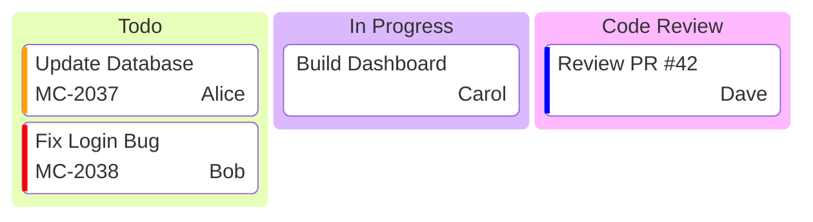
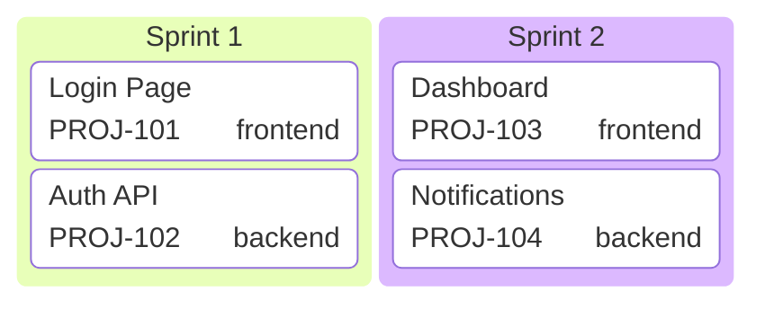

# Kanban Boards

Kanban diagrams visualize workflow stages with tasks in columns.

## Declaration

## Basic Kanban

Define columns with `id[Title]` and tasks indented beneath.

## With Metadata

Add ticket, assignee, and priority with `@{ key: value }`.

## Ticket References

Link tasks to external ticket systems.

