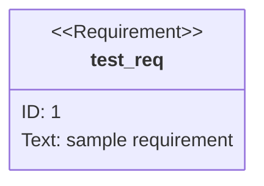
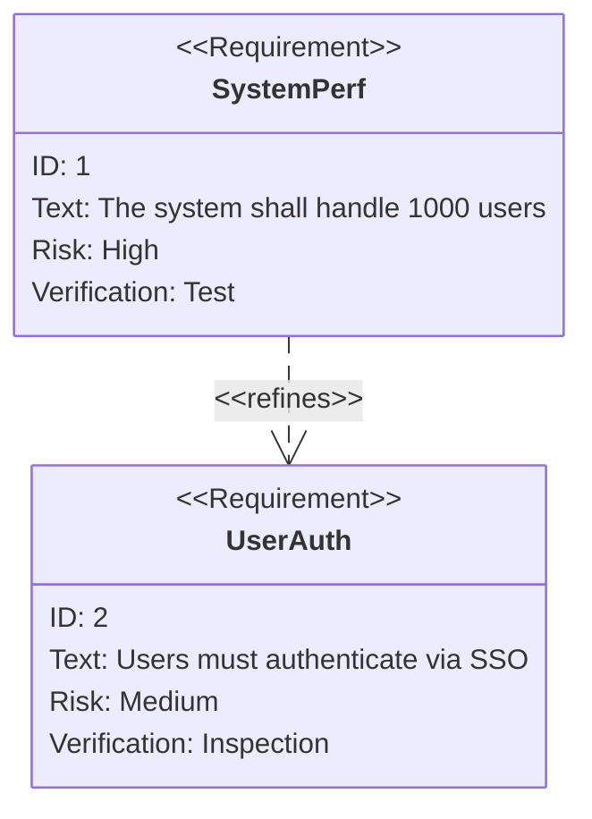
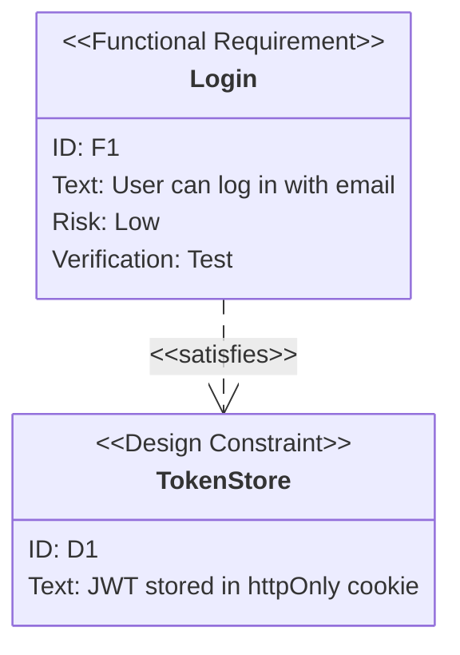
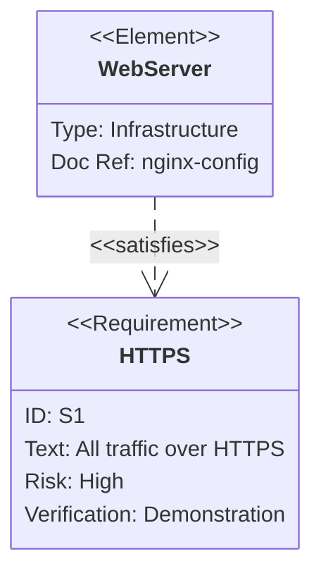
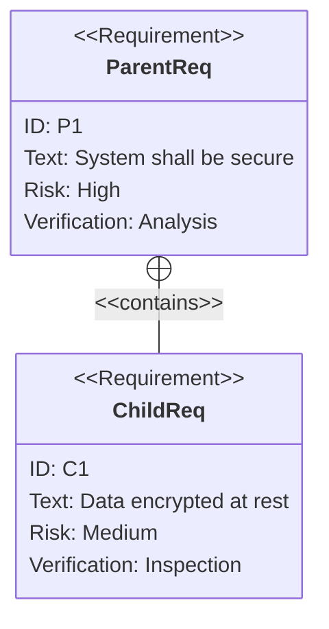
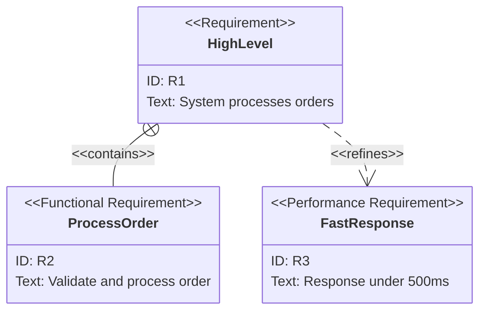

# Requirement Diagrams

Requirement diagrams model system requirements and their relationships (SysML-style).

## Declaration

## Basic Requirements

Define requirements with `id`, `text`, `risk`, and `verifymethod`. Link with relationship keywords.

## Functional and Design Requirements

Use different requirement types.

## Elements and Relationships

Connect requirements to system elements with `satisfies`, `traces`, `verifies`, etc.

## Contains Relationships

Nest sub-requirements with `contains`.

## Multiple Relationship Types

Use `satisfies`, `contains`, `traces`, `verifies`, `refines`, `derives`, `copies`.

