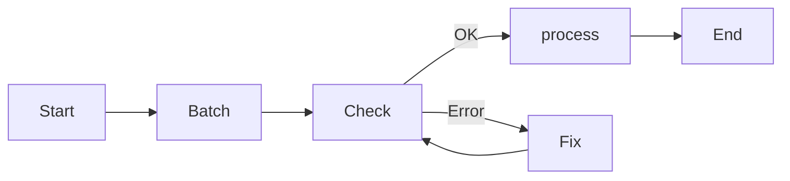
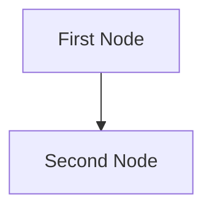

# Agentic Coding

Agentic Coding is PocketFlow's development methodology: **humans design, agents code**. It's an 8-step process that balances human judgment with AI implementation speed.

## The 8 Steps

| Step | Human | AI | Description |
|---|---|---|---|
| 1. Requirements | ★★★ | ★☆☆ | Humans understand requirements and context |
| 2. Flow | ★★☆ | ★★☆ | Humans specify high-level design, AI fills details |
| 3. Utilities | ★★☆ | ★★☆ | Humans provide APIs/integrations, AI implements |
| 4. Data | ★☆☆ | ★★★ | AI designs shared store schema, humans verify |
| 5. Node | ★☆☆ | ★★★ | AI designs nodes based on flow |
| 6. Implementation | ★☆☆ | ★★★ | AI implements flow based on design |
| 7. Optimization | ★★☆ | ★★☆ | Humans evaluate, AI helps optimize |
| 8. Reliability | ★☆☆ | ★★★ | AI writes tests and handles corner cases |

### Step 1: Requirements

Clarify what the project needs. Evaluate whether AI is a good fit.

**Good for AI**:
- Routine tasks requiring common sense (filling forms, replying to emails)
- Creative tasks with well-defined inputs (building slides, writing SQL)

**Not good for AI**:
- Ambiguous problems requiring complex decision-making (business strategy, startup planning)

**Keep it user-centric**: Explain the "problem" from the user's perspective, not just features.

### Step 2: Flow Design

Outline how the AI system orchestrates nodes.

1. Identify applicable design patterns (Map-Reduce, Agent, RAG, Workflow)
2. For each node, write a high-level one-line description
3. Draw a Mermaid diagram



> If humans can't specify the flow, AI agents can't automate it. Manually solve example inputs first to develop intuition.

### Step 3: Utilities

Identify and implement external utility functions — the "body" that lets your AI "brain" interact with the world.

**Utilities are external interactions**:
- Reading inputs (Slack messages, emails, files)
- Writing outputs (reports, emails, API calls)
- Using external tools (LLM calls, web search)

**LLM-based tasks are NOT utilities** — they are core functions internal to the AI system.

For each utility:
1. Implement and write a simple test
2. Document input/output and necessity

```python
# utils/call_llm.py
from openai import OpenAI

def call_llm(prompt: str) -> str:
    client = OpenAI(api_key="YOUR_API_KEY")
    r = client.chat.completions.create(
        model="gpt-4o",
        messages=[{"role": "user", "content": prompt}]
    )
    return r.choices[0].message.content

if __name__ == "__main__":
    print(call_llm("Hello, how are you?"))
```

> **Avoid exception handling in utilities** — let Node's retry mechanism handle failures.

### Step 4: Data Design

Design the shared store — the data contract all nodes agree upon.

- Simple systems: in-memory dictionary
- Complex systems or persistence needed: database
- **Don't Repeat Yourself**: use in-memory references or foreign keys

```python
shared = {
    "user": {
        "id": "user123",
        "context": {
            "weather": {"temp": 72, "condition": "sunny"},
            "location": "San Francisco"
        }
    },
    "results": {}
}
```

### Step 5: Node Design

For each node, describe its type, data access, and utility usage:

```
1. First Node
   - Purpose: Provide a short explanation
   - Type: Regular, Batch, or Async
   - prep: Read "key" from shared store
   - exec: Call utility function
   - post: Write "key" to shared store
```

### Step 6: Implementation

Implement nodes and flows based on the design.

- **Keep it simple, stupid!** — avoid complex features and full-scale type checking
- **Fail fast!** — leverage Node retry and fallback mechanisms
- Add logging throughout for debugging

### Step 7: Optimization

- **Use intuition** for quick initial evaluation
- **Redesign flow** (back to Step 2): break down tasks further, introduce agentic decisions, manage input contexts
- **Micro-optimizations**: prompt engineering, in-context learning with examples

> Expect to repeat Steps 3–6 hundreds of times.

### Step 8: Reliability

- **Node retries**: increase `max_retries` and `wait` times
- **Logging and visualization**: maintain logs, visualize node results
- **Self-evaluation**: add LLM-powered review nodes for uncertain outputs

## Project Structure

```
my_project/
├── main.py              # Entry point
├── nodes.py             # All node definitions
├── flow.py              # Flow creation functions
├── utils/
│   ├── __init__.py
│   ├── call_llm.py      # One file per API call
│   └── search_web.py
├── requirements.txt
└── docs/
    └── design.md        # High-level, no-code design doc
```

### requirements.txt

```
PyYAML
pocketflow
```

### docs/design.md Template

```markdown
# Design Doc: Your Project Name

## Requirements
> Keep it simple. Write concrete user stories if abstract.

## Flow Design
### Applicable Design Patterns:
1. Map the file summary into chunks, then reduce into final summary
2. Agentic file finder
   - Context: entire summary of the file
   - Action: find the file

### Flow High-Level Design:
1. First Node: This node is for ...
2. Second Node: This node is for ...



## Utility Functions
1. Call LLM (`utils/call_llm.py`)
   - Input: prompt (str)
   - Output: response (str)

## Node Design
### Shared Store
```python
shared = {"key": "value"}
```

### Node Steps
1. First Node
   - Purpose: ...
   - Type: Regular/Batch/Async
   - prep: Read "key" from shared
   - exec: Call utility
   - post: Write "key" to shared
```

## Best Practices

1. **Start with a small and simple solution** — iterate from there
2. **Design at high level before implementation** — write `docs/design.md` first
3. **Frequently ask humans for feedback** — don't over-engineer without validation
4. **Sometimes design Utilities before Flow** — for projects interfacing with legacy systems, start with the hardest integration points
5. **Avoid exception handling in utilities** — let Node's built-in retry handle failures
